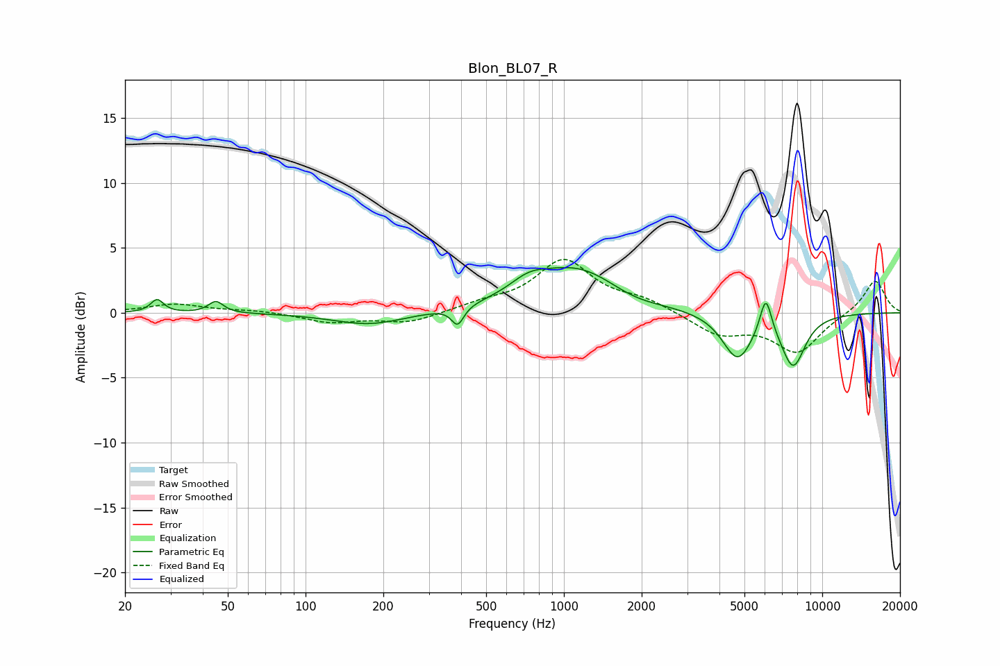

# Blon_BL07_R
See [usage instructions](https://github.com/jaakkopasanen/AutoEq#usage) for more options and info.

### Parametric EQs
Apply preamp of -3.6 dB when using parametric equalizer.

|   # | Type    |   Fc (Hz) |    Q |   Gain (dB) |
|-----|---------|-----------|------|-------------|
|   1 | Peaking |        27 | 5.9  |         1   |
|   2 | Peaking |        45 | 5    |         0.9 |
|   3 | Peaking |       177 | 1    |        -1   |
|   4 | Peaking |       388 | 6    |        -1.4 |
|   5 | Peaking |       728 | 2    |         1   |
|   6 | Peaking |      1126 | 0.8  |         3.5 |
|   7 | Peaking |      1843 | 1.31 |        -0.6 |
|   8 | Peaking |      4700 | 2.38 |        -3.5 |
|   9 | Peaking |      6048 | 6    |         3   |
|  10 | Peaking |      7717 | 2.81 |        -4   |

### Fixed Band EQs
When using fixed band (also called graphic) equalizer, apply preamp of **-4.2 dB** (if available) and set gains manually with these parameters.

|   # | Type    |   Fc (Hz) |    Q |   Gain (dB) |
|-----|---------|-----------|------|-------------|
|   1 | Peaking |        31 | 1.41 |         0.7 |
|   2 | Peaking |        62 | 1.41 |         0.2 |
|   3 | Peaking |       125 | 1.41 |        -0.7 |
|   4 | Peaking |       250 | 1.41 |        -0.8 |
|   5 | Peaking |       500 | 1.41 |         0.6 |
|   6 | Peaking |      1000 | 1.41 |         3.9 |
|   7 | Peaking |      2000 | 1.41 |         0.9 |
|   8 | Peaking |      4000 | 1.41 |        -1.6 |
|   9 | Peaking |      8000 | 1.41 |        -3   |
|  10 | Peaking |     16000 | 1.41 |         2.6 |

### Graphs

