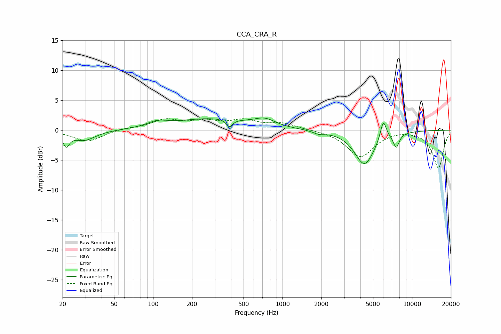

# CCA_CRA_R
See [usage instructions](https://github.com/jaakkopasanen/AutoEq#usage) for more options and info.

### Parametric EQs
Apply preamp of -2.1 dB when using parametric equalizer.

|   # | Type    |   Fc (Hz) |    Q |   Gain (dB) |
|-----|---------|-----------|------|-------------|
|   1 | Peaking |        21 | 5.97 |        -2.1 |
|   2 | Peaking |        29 | 1.61 |        -1.7 |
|   3 | Peaking |       108 | 1.85 |         0.9 |
|   4 | Peaking |       281 | 0.51 |         1.9 |
|   5 | Peaking |       390 | 6    |        -1.3 |
|   6 | Peaking |       730 | 1.73 |         1.3 |
|   7 | Peaking |      1912 | 3.22 |        -0.5 |
|   8 | Peaking |      4297 | 1.83 |        -5.7 |
|   9 | Peaking |      6008 | 5.77 |         3.4 |
|  10 | Peaking |      7564 | 5.74 |        -2.4 |

### Fixed Band EQs
When using fixed band (also called graphic) equalizer, apply preamp of **-2.0 dB** (if available) and set gains manually with these parameters.

|   # | Type    |   Fc (Hz) |    Q |   Gain (dB) |
|-----|---------|-----------|------|-------------|
|   1 | Peaking |        31 | 1.41 |        -1.9 |
|   2 | Peaking |        62 | 1.41 |         0.3 |
|   3 | Peaking |       125 | 1.41 |         1.6 |
|   4 | Peaking |       250 | 1.41 |         1.3 |
|   5 | Peaking |       500 | 1.41 |         1.5 |
|   6 | Peaking |      1000 | 1.41 |         1   |
|   7 | Peaking |      2000 | 1.41 |         0   |
|   8 | Peaking |      4000 | 1.41 |        -4.4 |
|   9 | Peaking |      8000 | 1.41 |         0.2 |
|  10 | Peaking |     16000 | 1.41 |        -6.3 |

### Graphs

