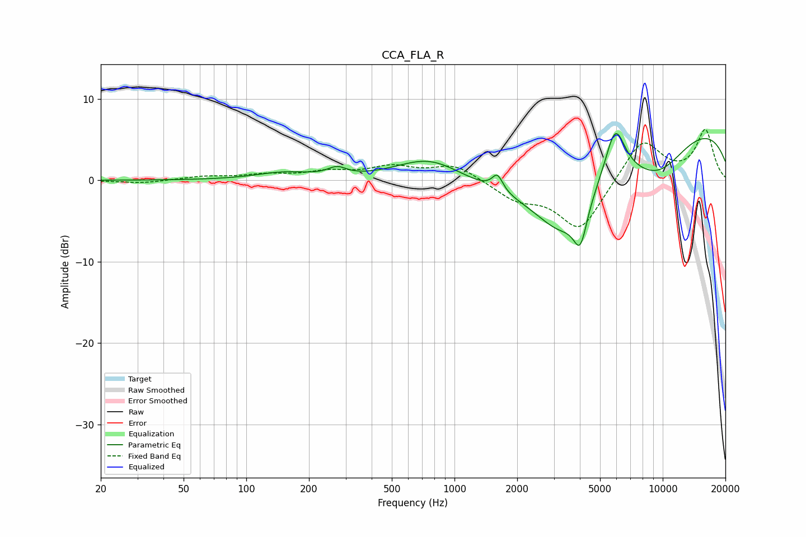

# CCA_FLA_R
See [usage instructions](https://github.com/jaakkopasanen/AutoEq#usage) for more options and info.

### Parametric EQs
Apply preamp of -5.8 dB when using parametric equalizer.

|   # | Type    |   Fc (Hz) |    Q |   Gain (dB) |
|-----|---------|-----------|------|-------------|
|   1 | Peaking |       152 | 1.06 |         0.9 |
|   2 | Peaking |       273 | 3.15 |         1   |
|   3 | Peaking |       765 | 0.82 |         3.8 |
|   4 | Peaking |      1608 | 5.5  |         2   |
|   5 | Peaking |      2448 | 0.29 |        -3.7 |
|   6 | Peaking |      3299 | 0.96 |        -7.7 |
|   7 | Peaking |      4021 | 4.35 |        -4.7 |
|   8 | Peaking |      5912 | 2.84 |         6.4 |
|   9 | Peaking |      9383 | 0.18 |         7.9 |
|  10 | Peaking |      9513 | 0.83 |        -4.8 |

### Fixed Band EQs
When using fixed band (also called graphic) equalizer, apply preamp of **-6.3 dB** (if available) and set gains manually with these parameters.

|   # | Type    |   Fc (Hz) |    Q |   Gain (dB) |
|-----|---------|-----------|------|-------------|
|   1 | Peaking |        31 | 1.41 |        -0.4 |
|   2 | Peaking |        62 | 1.41 |         0.4 |
|   3 | Peaking |       125 | 1.41 |         0.6 |
|   4 | Peaking |       250 | 1.41 |         0.9 |
|   5 | Peaking |       500 | 1.41 |         1.5 |
|   6 | Peaking |      1000 | 1.41 |         1.9 |
|   7 | Peaking |      2000 | 1.41 |        -2.1 |
|   8 | Peaking |      4000 | 1.41 |        -6.2 |
|   9 | Peaking |      8000 | 1.41 |         5.2 |
|  10 | Peaking |     16000 | 1.41 |         6.1 |

### Graphs

