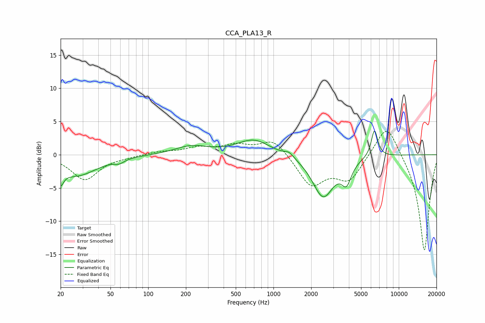

# CCA_PLA13_R
See [usage instructions](https://github.com/jaakkopasanen/AutoEq#usage) for more options and info.

### Parametric EQs
Apply preamp of -3.7 dB when using parametric equalizer.

|   # | Type    |   Fc (Hz) |    Q |   Gain (dB) |
|-----|---------|-----------|------|-------------|
|   1 | Peaking |        20 | 5.86 |        -4   |
|   2 | Peaking |        20 | 6    |         1.8 |
|   3 | Peaking |        27 | 0.85 |        -3.1 |
|   4 | Peaking |        59 | 3.85 |        -0.5 |
|   5 | Peaking |       221 | 1.09 |         1.2 |
|   6 | Peaking |       696 | 1.08 |         2.3 |
|   7 | Peaking |      1333 | 3.89 |         0.7 |
|   8 | Peaking |      2490 | 1.66 |        -6.3 |
|   9 | Peaking |      3826 | 3.59 |        -3   |
|  10 | Peaking |      6398 | 5.34 |         4.1 |

### Fixed Band EQs
When using fixed band (also called graphic) equalizer, apply preamp of **-3.6 dB** (if available) and set gains manually with these parameters.

|   # | Type    |   Fc (Hz) |    Q |   Gain (dB) |
|-----|---------|-----------|------|-------------|
|   1 | Peaking |        31 | 1.41 |        -3.7 |
|   2 | Peaking |        62 | 1.41 |        -0.2 |
|   3 | Peaking |       125 | 1.41 |         0.4 |
|   4 | Peaking |       250 | 1.41 |         1   |
|   5 | Peaking |       500 | 1.41 |         1.3 |
|   6 | Peaking |      1000 | 1.41 |         2.5 |
|   7 | Peaking |      2000 | 1.41 |        -4.6 |
|   8 | Peaking |      4000 | 1.41 |        -3.7 |
|   9 | Peaking |      8000 | 1.41 |         5.2 |
|  10 | Peaking |     16000 | 1.41 |       -14.7 |

### Graphs

