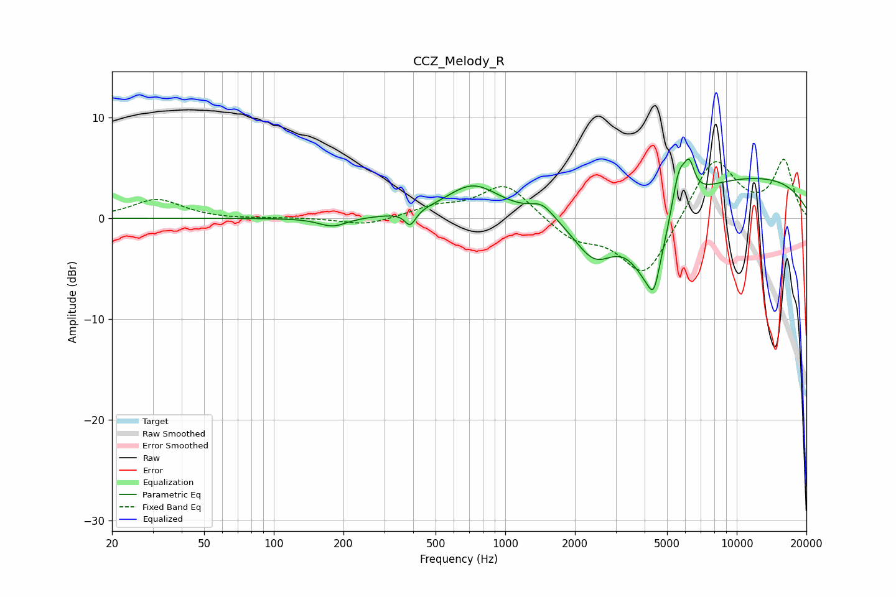

# CCZ_Melody_R
See [usage instructions](https://github.com/jaakkopasanen/AutoEq#usage) for more options and info.

### Parametric EQs
Apply preamp of -6.0 dB when using parametric equalizer.

|   # | Type    |   Fc (Hz) |    Q |   Gain (dB) |
|-----|---------|-----------|------|-------------|
|   1 | Peaking |       180 | 2.36 |        -0.9 |
|   2 | Peaking |       389 | 5.99 |        -1.5 |
|   3 | Peaking |       725 | 1.22 |         3.2 |
|   4 | Peaking |      1444 | 2.76 |         1.3 |
|   5 | Peaking |      2432 | 1.5  |        -4.6 |
|   6 | Peaking |      4235 | 1.66 |        -7.8 |
|   7 | Peaking |      4385 | 5.97 |        -2.4 |
|   8 | Peaking |      5618 | 4.38 |         4.3 |
|   9 | Peaking |      6241 | 6    |         2.9 |
|  10 | Peaking |     10000 | 0.24 |         4.3 |

### Fixed Band EQs
When using fixed band (also called graphic) equalizer, apply preamp of **-6.0 dB** (if available) and set gains manually with these parameters.

|   # | Type    |   Fc (Hz) |    Q |   Gain (dB) |
|-----|---------|-----------|------|-------------|
|   1 | Peaking |        31 | 1.41 |         1.9 |
|   2 | Peaking |        62 | 1.41 |        -0.1 |
|   3 | Peaking |       125 | 1.41 |         0   |
|   4 | Peaking |       250 | 1.41 |        -0.7 |
|   5 | Peaking |       500 | 1.41 |         1   |
|   6 | Peaking |      1000 | 1.41 |         3.5 |
|   7 | Peaking |      2000 | 1.41 |        -2   |
|   8 | Peaking |      4000 | 1.41 |        -5.9 |
|   9 | Peaking |      8000 | 1.41 |         6.2 |
|  10 | Peaking |     16000 | 1.41 |         5.6 |

### Graphs

