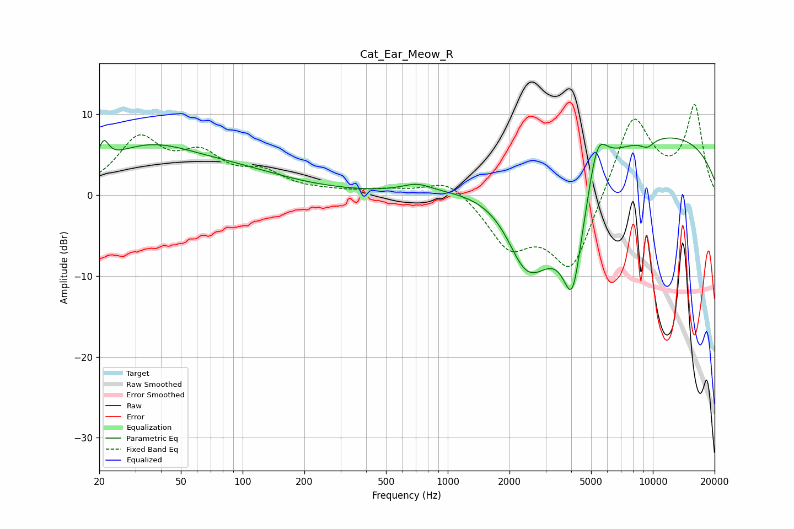

# Cat_Ear_Meow_R
See [usage instructions](https://github.com/jaakkopasanen/AutoEq#usage) for more options and info.

### Parametric EQs
Apply preamp of -7.1 dB when using parametric equalizer.

|   # | Type    |   Fc (Hz) |    Q |   Gain (dB) |
|-----|---------|-----------|------|-------------|
|   1 | Peaking |        21 | 6    |         2.5 |
|   2 | Peaking |        34 | 0.59 |         5.2 |
|   3 | Peaking |        93 | 0.51 |         2.2 |
|   4 | Peaking |       705 | 1.99 |         1   |
|   5 | Peaking |      2329 | 1.83 |        -3.8 |
|   6 | Peaking |      2713 | 1.01 |        -9.5 |
|   7 | Peaking |      4059 | 2.31 |       -14   |
|   8 | Peaking |      5364 | 2.91 |         6.1 |
|   9 | Peaking |      8383 | 0.19 |         8.1 |
|  10 | Peaking |      9392 | 3.57 |        -1   |

### Fixed Band EQs
When using fixed band (also called graphic) equalizer, apply preamp of **-11.3 dB** (if available) and set gains manually with these parameters.

|   # | Type    |   Fc (Hz) |    Q |   Gain (dB) |
|-----|---------|-----------|------|-------------|
|   1 | Peaking |        31 | 1.41 |         6.6 |
|   2 | Peaking |        62 | 1.41 |         4.2 |
|   3 | Peaking |       125 | 1.41 |         2.3 |
|   4 | Peaking |       250 | 1.41 |         0.3 |
|   5 | Peaking |       500 | 1.41 |         0.5 |
|   6 | Peaking |      1000 | 1.41 |         2.2 |
|   7 | Peaking |      2000 | 1.41 |        -5.9 |
|   8 | Peaking |      4000 | 1.41 |        -9.6 |
|   9 | Peaking |      8000 | 1.41 |        10.3 |
|  10 | Peaking |     16000 | 1.41 |        10.8 |

### Graphs

