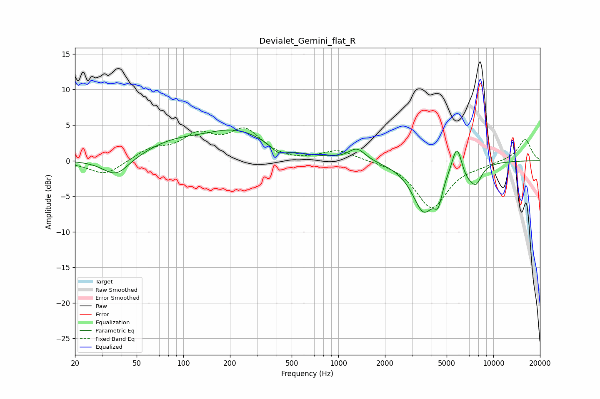

# Devialet_Gemini_flat_R
See [usage instructions](https://github.com/jaakkopasanen/AutoEq#usage) for more options and info.

### Parametric EQs
Apply preamp of -4.4 dB when using parametric equalizer.

|   # | Type    |   Fc (Hz) |    Q |   Gain (dB) |
|-----|---------|-----------|------|-------------|
|   1 | Peaking |        37 | 1.65 |        -2.6 |
|   2 | Peaking |        84 | 0.74 |         2   |
|   3 | Peaking |       220 | 0.66 |         3.8 |
|   4 | Peaking |       410 | 2.93 |        -1.1 |
|   5 | Peaking |      1318 | 2.66 |         1.7 |
|   6 | Peaking |      3562 | 1.87 |        -7   |
|   7 | Peaking |      4409 | 5.44 |        -2.9 |
|   8 | Peaking |      5821 | 4.38 |         4   |
|   9 | Peaking |      6737 | 3.37 |        -1.5 |
|  10 | Peaking |      7719 | 3.52 |        -2.5 |

### Fixed Band EQs
When using fixed band (also called graphic) equalizer, apply preamp of **-4.7 dB** (if available) and set gains manually with these parameters.

|   # | Type    |   Fc (Hz) |    Q |   Gain (dB) |
|-----|---------|-----------|------|-------------|
|   1 | Peaking |        31 | 1.41 |        -2.1 |
|   2 | Peaking |        62 | 1.41 |         1.5 |
|   3 | Peaking |       125 | 1.41 |         3.2 |
|   4 | Peaking |       250 | 1.41 |         4   |
|   5 | Peaking |       500 | 1.41 |        -0.2 |
|   6 | Peaking |      1000 | 1.41 |         1.5 |
|   7 | Peaking |      2000 | 1.41 |         0   |
|   8 | Peaking |      4000 | 1.41 |        -6.6 |
|   9 | Peaking |      8000 | 1.41 |        -0.4 |
|  10 | Peaking |     16000 | 1.41 |         3.1 |

### Graphs

