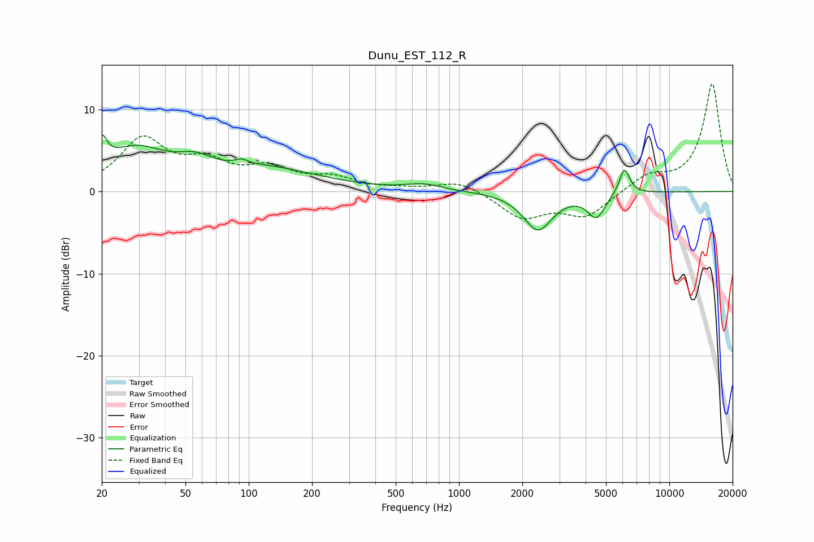

# Dunu_EST_112_R
See [usage instructions](https://github.com/jaakkopasanen/AutoEq#usage) for more options and info.

### Parametric EQs
Apply preamp of -7.0 dB when using parametric equalizer.

|   # | Type    |   Fc (Hz) |    Q |   Gain (dB) |
|-----|---------|-----------|------|-------------|
|   1 | Peaking |        20 | 5.76 |         3.3 |
|   2 | Peaking |        29 | 0.91 |         4.7 |
|   3 | Peaking |        55 | 1.76 |         1.6 |
|   4 | Peaking |        92 | 5.85 |        -2.6 |
|   5 | Peaking |        92 | 5.68 |         3.2 |
|   6 | Peaking |       119 | 0.54 |         2.6 |
|   7 | Peaking |       679 | 1.67 |         0.8 |
|   8 | Peaking |      2373 | 2.06 |        -4.6 |
|   9 | Peaking |      4499 | 3.37 |        -2.9 |
|  10 | Peaking |      6117 | 5.5  |         3.2 |

### Fixed Band EQs
When using fixed band (also called graphic) equalizer, apply preamp of **-13.2 dB** (if available) and set gains manually with these parameters.

|   # | Type    |   Fc (Hz) |    Q |   Gain (dB) |
|-----|---------|-----------|------|-------------|
|   1 | Peaking |        31 | 1.41 |         6.1 |
|   2 | Peaking |        62 | 1.41 |         2.9 |
|   3 | Peaking |       125 | 1.41 |         2.4 |
|   4 | Peaking |       250 | 1.41 |         1.4 |
|   5 | Peaking |       500 | 1.41 |         0.2 |
|   6 | Peaking |      1000 | 1.41 |         1.3 |
|   7 | Peaking |      2000 | 1.41 |        -3.1 |
|   8 | Peaking |      4000 | 1.41 |        -3   |
|   9 | Peaking |      8000 | 1.41 |         1.8 |
|  10 | Peaking |     16000 | 1.41 |        13.2 |

### Graphs

