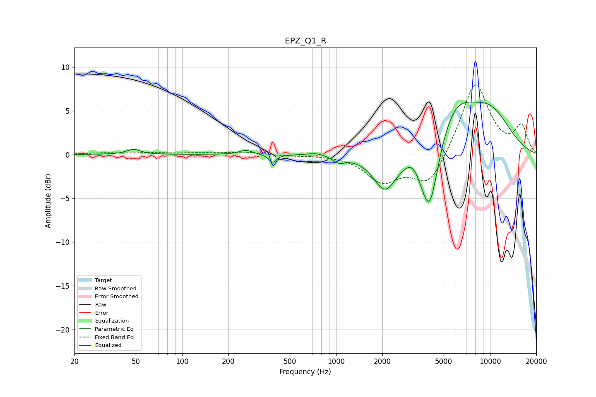

# EPZ_Q1_R
See [usage instructions](https://github.com/jaakkopasanen/AutoEq#usage) for more options and info.

### Parametric EQs
Apply preamp of -6.1 dB when using parametric equalizer.

|   # | Type    |   Fc (Hz) |    Q |   Gain (dB) |
|-----|---------|-----------|------|-------------|
|   1 | Peaking |        48 | 3.29 |         0.6 |
|   2 | Peaking |       260 | 3.28 |         0.5 |
|   3 | Peaking |       387 | 6    |        -0.9 |
|   4 | Peaking |       752 | 2.43 |         0.3 |
|   5 | Peaking |      1043 | 3.63 |        -0.7 |
|   6 | Peaking |      2082 | 1.85 |        -4.1 |
|   7 | Peaking |      3137 | 2.83 |         1.1 |
|   8 | Peaking |      4036 | 2.26 |        -9   |
|   9 | Peaking |      5854 | 1.03 |         5.3 |
|  10 | Peaking |     10000 | 0.82 |         4.3 |

### Fixed Band EQs
When using fixed band (also called graphic) equalizer, apply preamp of **-8.0 dB** (if available) and set gains manually with these parameters.

|   # | Type    |   Fc (Hz) |    Q |   Gain (dB) |
|-----|---------|-----------|------|-------------|
|   1 | Peaking |        31 | 1.41 |         0.2 |
|   2 | Peaking |        62 | 1.41 |         0.2 |
|   3 | Peaking |       125 | 1.41 |         0.1 |
|   4 | Peaking |       250 | 1.41 |         0.3 |
|   5 | Peaking |       500 | 1.41 |        -0.1 |
|   6 | Peaking |      1000 | 1.41 |         0   |
|   7 | Peaking |      2000 | 1.41 |        -3   |
|   8 | Peaking |      4000 | 1.41 |        -3.7 |
|   9 | Peaking |      8000 | 1.41 |         8.4 |
|  10 | Peaking |     16000 | 1.41 |         3.1 |

### Graphs

