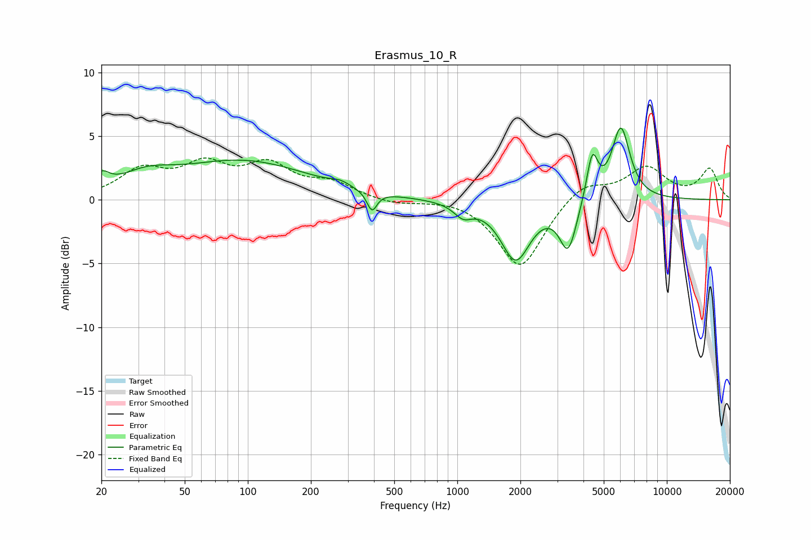

# Erasmus_10_R
See [usage instructions](https://github.com/jaakkopasanen/AutoEq#usage) for more options and info.

### Parametric EQs
Apply preamp of -5.7 dB when using parametric equalizer.

|   # | Type    |   Fc (Hz) |    Q |   Gain (dB) |
|-----|---------|-----------|------|-------------|
|   1 | Peaking |        20 | 3.88 |         1.1 |
|   2 | Peaking |        33 | 1.12 |         1.3 |
|   3 | Peaking |        95 | 0.45 |         3   |
|   4 | Peaking |       276 | 3.13 |         0.4 |
|   5 | Peaking |       391 | 5.99 |        -1.5 |
|   6 | Peaking |      1065 | 3.31 |        -1   |
|   7 | Peaking |      1898 | 2.03 |        -4.6 |
|   8 | Peaking |      3381 | 3.44 |        -3.9 |
|   9 | Peaking |      4406 | 5.15 |         3.6 |
|  10 | Peaking |      6032 | 3.16 |         5.7 |

### Fixed Band EQs
When using fixed band (also called graphic) equalizer, apply preamp of **-3.4 dB** (if available) and set gains manually with these parameters.

|   # | Type    |   Fc (Hz) |    Q |   Gain (dB) |
|-----|---------|-----------|------|-------------|
|   1 | Peaking |        31 | 1.41 |         2.2 |
|   2 | Peaking |        62 | 1.41 |         2.4 |
|   3 | Peaking |       125 | 1.41 |         2.4 |
|   4 | Peaking |       250 | 1.41 |         1.2 |
|   5 | Peaking |       500 | 1.41 |        -0.4 |
|   6 | Peaking |      1000 | 1.41 |         0.2 |
|   7 | Peaking |      2000 | 1.41 |        -5.4 |
|   8 | Peaking |      4000 | 1.41 |         1.5 |
|   9 | Peaking |      8000 | 1.41 |         2.5 |
|  10 | Peaking |     16000 | 1.41 |         2.4 |

### Graphs

