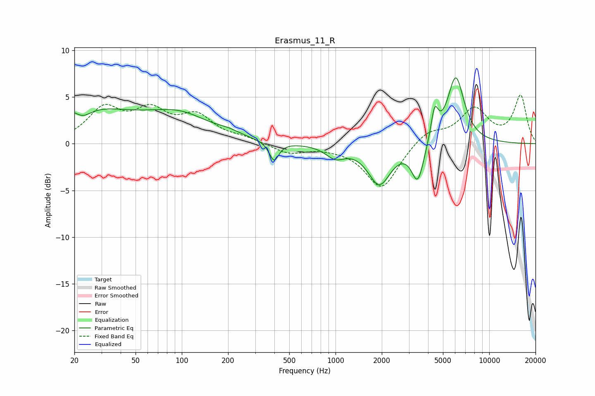

# Erasmus_11_R
See [usage instructions](https://github.com/jaakkopasanen/AutoEq#usage) for more options and info.

### Parametric EQs
Apply preamp of -7.1 dB when using parametric equalizer.

|   # | Type    |   Fc (Hz) |    Q |   Gain (dB) |
|-----|---------|-----------|------|-------------|
|   1 | Peaking |        20 | 0.34 |         3.8 |
|   2 | Peaking |        23 | 2.6  |        -1   |
|   3 | Peaking |        98 | 0.72 |         2.4 |
|   4 | Peaking |       201 | 1.84 |         0.4 |
|   5 | Peaking |       398 | 4.61 |        -2.1 |
|   6 | Peaking |       996 | 2.32 |        -1.3 |
|   7 | Peaking |      1929 | 1.92 |        -4.2 |
|   8 | Peaking |      3430 | 3.5  |        -4.1 |
|   9 | Peaking |      4413 | 5.85 |         3.3 |
|  10 | Peaking |      6056 | 2.46 |         7.2 |

### Fixed Band EQs
When using fixed band (also called graphic) equalizer, apply preamp of **-5.3 dB** (if available) and set gains manually with these parameters.

|   # | Type    |   Fc (Hz) |    Q |   Gain (dB) |
|-----|---------|-----------|------|-------------|
|   1 | Peaking |        31 | 1.41 |         3.5 |
|   2 | Peaking |        62 | 1.41 |         3.1 |
|   3 | Peaking |       125 | 1.41 |         2.7 |
|   4 | Peaking |       250 | 1.41 |         0.5 |
|   5 | Peaking |       500 | 1.41 |        -1   |
|   6 | Peaking |      1000 | 1.41 |        -0.2 |
|   7 | Peaking |      2000 | 1.41 |        -4.8 |
|   8 | Peaking |      4000 | 1.41 |         1.4 |
|   9 | Peaking |      8000 | 1.41 |         3.6 |
|  10 | Peaking |     16000 | 1.41 |         5   |

### Graphs

