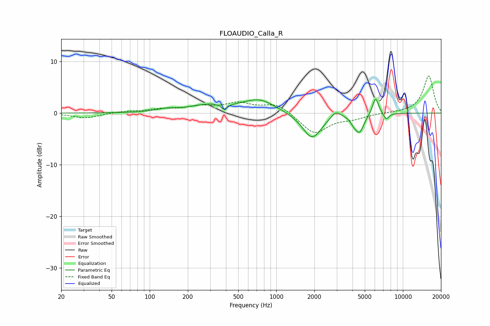

# FLOAUDIO_Calla_R
See [usage instructions](https://github.com/jaakkopasanen/AutoEq#usage) for more options and info.

### Parametric EQs
Apply preamp of -2.8 dB when using parametric equalizer.

|   # | Type    |   Fc (Hz) |    Q |   Gain (dB) |
|-----|---------|-----------|------|-------------|
|   1 | Peaking |       135 | 1.8  |         0.5 |
|   2 | Peaking |       300 | 0.9  |         1.5 |
|   3 | Peaking |       388 | 6    |        -1.1 |
|   4 | Peaking |       735 | 1.13 |         2.5 |
|   5 | Peaking |      1917 | 1.87 |        -5   |
|   6 | Peaking |      2948 | 3.48 |         1.4 |
|   7 | Peaking |      4092 | 5.67 |        -0.9 |
|   8 | Peaking |      4547 | 4    |        -3.4 |
|   9 | Peaking |      6084 | 5.63 |         3.4 |
|  10 | Peaking |      7374 | 6    |        -1.3 |

### Fixed Band EQs
When using fixed band (also called graphic) equalizer, apply preamp of **-7.3 dB** (if available) and set gains manually with these parameters.

|   # | Type    |   Fc (Hz) |    Q |   Gain (dB) |
|-----|---------|-----------|------|-------------|
|   1 | Peaking |        31 | 1.41 |        -1   |
|   2 | Peaking |        62 | 1.41 |         0.3 |
|   3 | Peaking |       125 | 1.41 |         0.6 |
|   4 | Peaking |       250 | 1.41 |         1.1 |
|   5 | Peaking |       500 | 1.41 |         1.7 |
|   6 | Peaking |      1000 | 1.41 |         1.8 |
|   7 | Peaking |      2000 | 1.41 |        -4   |
|   8 | Peaking |      4000 | 1.41 |        -0.9 |
|   9 | Peaking |      8000 | 1.41 |         0   |
|  10 | Peaking |     16000 | 1.41 |         7.2 |

### Graphs

