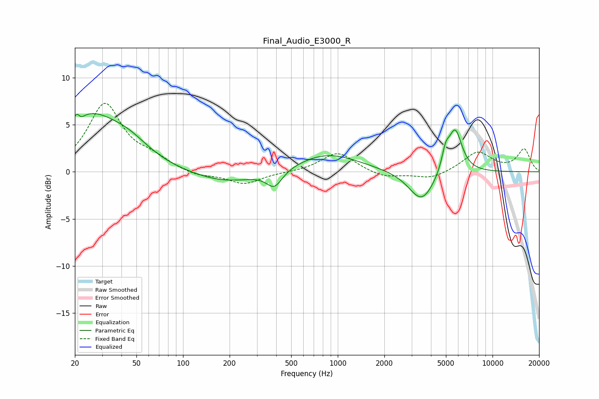

# Final_Audio_E3000_R
See [usage instructions](https://github.com/jaakkopasanen/AutoEq#usage) for more options and info.

### Parametric EQs
Apply preamp of -6.3 dB when using parametric equalizer.

|   # | Type    |   Fc (Hz) |    Q |   Gain (dB) |
|-----|---------|-----------|------|-------------|
|   1 | Peaking |        21 | 5.87 |         3.3 |
|   2 | Peaking |        21 | 5.93 |        -2.9 |
|   3 | Peaking |        25 | 0.74 |         5.5 |
|   4 | Peaking |        45 | 1.03 |         1.7 |
|   5 | Peaking |       190 | 0.65 |        -1.2 |
|   6 | Peaking |       390 | 2.78 |        -1.8 |
|   7 | Peaking |       855 | 0.69 |         2   |
|   8 | Peaking |      3488 | 1.7  |        -3.3 |
|   9 | Peaking |      4971 | 5.74 |         1.8 |
|  10 | Peaking |      5727 | 3.06 |         4.7 |

### Fixed Band EQs
When using fixed band (also called graphic) equalizer, apply preamp of **-7.4 dB** (if available) and set gains manually with these parameters.

|   # | Type    |   Fc (Hz) |    Q |   Gain (dB) |
|-----|---------|-----------|------|-------------|
|   1 | Peaking |        31 | 1.41 |         7.1 |
|   2 | Peaking |        62 | 1.41 |         1.1 |
|   3 | Peaking |       125 | 1.41 |        -0.5 |
|   4 | Peaking |       250 | 1.41 |        -1.3 |
|   5 | Peaking |       500 | 1.41 |        -0   |
|   6 | Peaking |      1000 | 1.41 |         2.1 |
|   7 | Peaking |      2000 | 1.41 |        -0.7 |
|   8 | Peaking |      4000 | 1.41 |        -0.8 |
|   9 | Peaking |      8000 | 1.41 |         2.1 |
|  10 | Peaking |     16000 | 1.41 |         2.4 |

### Graphs

