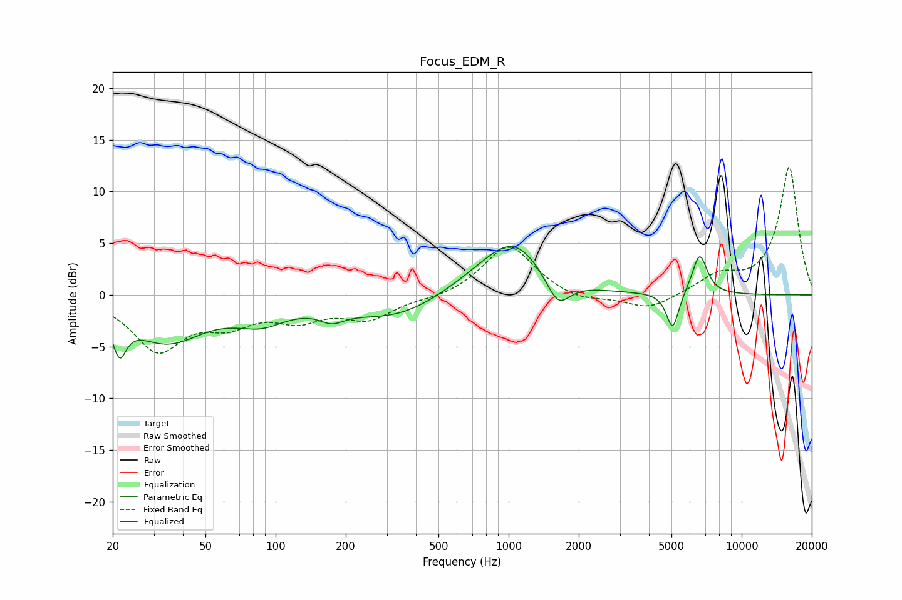

# Focus_EDM_R
See [usage instructions](https://github.com/jaakkopasanen/AutoEq#usage) for more options and info.

### Parametric EQs
Apply preamp of -4.8 dB when using parametric equalizer.

|   # | Type    |   Fc (Hz) |    Q |   Gain (dB) |
|-----|---------|-----------|------|-------------|
|   1 | Peaking |        21 | 4.95 |        -3.5 |
|   2 | Peaking |        34 | 0.88 |        -4.3 |
|   3 | Peaking |        87 | 1.28 |        -1.9 |
|   4 | Peaking |       174 | 2.64 |        -1.1 |
|   5 | Peaking |       325 | 0.68 |        -2.3 |
|   6 | Peaking |       764 | 0.83 |         1.3 |
|   7 | Peaking |      1056 | 1.13 |         4.5 |
|   8 | Peaking |      1629 | 2.77 |        -2.9 |
|   9 | Peaking |      5056 | 5.31 |        -3.6 |
|  10 | Peaking |      6601 | 4.28 |         4   |

### Fixed Band EQs
When using fixed band (also called graphic) equalizer, apply preamp of **-12.4 dB** (if available) and set gains manually with these parameters.

|   # | Type    |   Fc (Hz) |    Q |   Gain (dB) |
|-----|---------|-----------|------|-------------|
|   1 | Peaking |        31 | 1.41 |        -5.1 |
|   2 | Peaking |        62 | 1.41 |        -2.3 |
|   3 | Peaking |       125 | 1.41 |        -2   |
|   4 | Peaking |       250 | 1.41 |        -2.1 |
|   5 | Peaking |       500 | 1.41 |        -0.4 |
|   6 | Peaking |      1000 | 1.41 |         4.9 |
|   7 | Peaking |      2000 | 1.41 |        -0.7 |
|   8 | Peaking |      4000 | 1.41 |        -1.5 |
|   9 | Peaking |      8000 | 1.41 |         1.7 |
|  10 | Peaking |     16000 | 1.41 |        12.4 |

### Graphs

