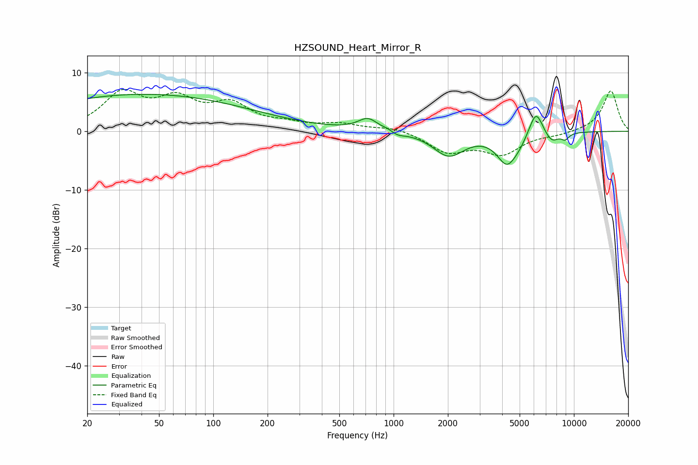

# HZSOUND_Heart_Mirror_R
See [usage instructions](https://github.com/jaakkopasanen/AutoEq#usage) for more options and info.

### Parametric EQs
Apply preamp of -6.4 dB when using parametric equalizer.

|   # | Type    |   Fc (Hz) |    Q |   Gain (dB) |
|-----|---------|-----------|------|-------------|
|   1 | Peaking |        41 | 0.23 |         6.3 |
|   2 | Peaking |       720 | 2.61 |         2.1 |
|   3 | Peaking |       924 | 5.96 |         0.2 |
|   4 | Peaking |      1057 | 3.91 |        -0.6 |
|   5 | Peaking |      2022 | 1.63 |        -4.1 |
|   6 | Peaking |      4253 | 2.49 |        -5.1 |
|   7 | Peaking |      4983 | 3.22 |        -1   |
|   8 | Peaking |      6157 | 3.6  |         4.5 |
|   9 | Peaking |      7512 | 3.41 |        -1.8 |
|  10 | Peaking |      8944 | 6    |        -1   |

### Fixed Band EQs
When using fixed band (also called graphic) equalizer, apply preamp of **-7.3 dB** (if available) and set gains manually with these parameters.

|   # | Type    |   Fc (Hz) |    Q |   Gain (dB) |
|-----|---------|-----------|------|-------------|
|   1 | Peaking |        31 | 1.41 |         6.1 |
|   2 | Peaking |        62 | 1.41 |         4.7 |
|   3 | Peaking |       125 | 1.41 |         4.1 |
|   4 | Peaking |       250 | 1.41 |         1   |
|   5 | Peaking |       500 | 1.41 |         1.1 |
|   6 | Peaking |      1000 | 1.41 |         0.8 |
|   7 | Peaking |      2000 | 1.41 |        -3.3 |
|   8 | Peaking |      4000 | 1.41 |        -3.6 |
|   9 | Peaking |      8000 | 1.41 |        -0.5 |
|  10 | Peaking |     16000 | 1.41 |         7   |

### Graphs

