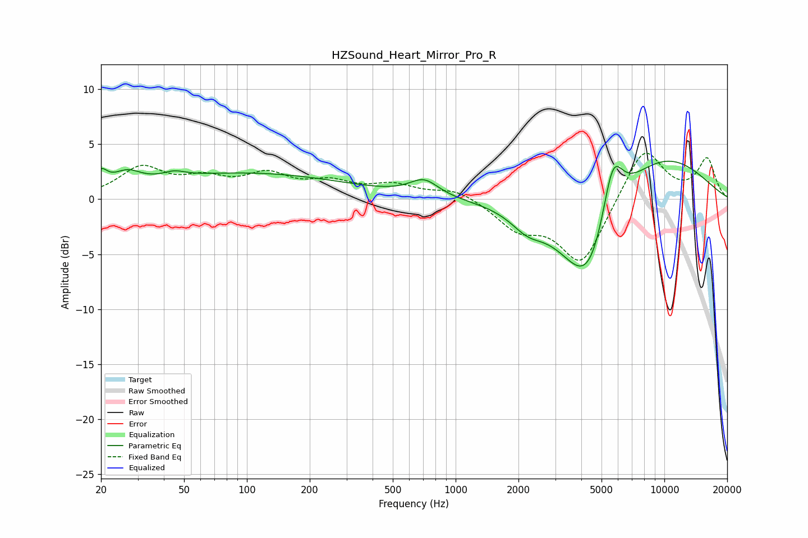

# HZSound_Heart_Mirror_Pro_R
See [usage instructions](https://github.com/jaakkopasanen/AutoEq#usage) for more options and info.

### Parametric EQs
Apply preamp of -3.6 dB when using parametric equalizer.

|   # | Type    |   Fc (Hz) |    Q |   Gain (dB) |
|-----|---------|-----------|------|-------------|
|   1 | Peaking |        20 | 4.75 |         1.4 |
|   2 | Peaking |        27 | 2.14 |         1.3 |
|   3 | Peaking |        45 | 2.74 |         0.5 |
|   4 | Peaking |       100 | 0.29 |         2.3 |
|   5 | Peaking |       705 | 2.04 |         1.5 |
|   6 | Peaking |      2205 | 1.79 |        -1.5 |
|   7 | Peaking |      4148 | 0.76 |        -3.3 |
|   8 | Peaking |      4380 | 1.22 |        -6.5 |
|   9 | Peaking |      5647 | 2.65 |         6   |
|  10 | Peaking |      8919 | 0.48 |         4.7 |

### Fixed Band EQs
When using fixed band (also called graphic) equalizer, apply preamp of **-4.3 dB** (if available) and set gains manually with these parameters.

|   # | Type    |   Fc (Hz) |    Q |   Gain (dB) |
|-----|---------|-----------|------|-------------|
|   1 | Peaking |        31 | 1.41 |         2.7 |
|   2 | Peaking |        62 | 1.41 |         1.5 |
|   3 | Peaking |       125 | 1.41 |         2   |
|   4 | Peaking |       250 | 1.41 |         1.3 |
|   5 | Peaking |       500 | 1.41 |         1.2 |
|   6 | Peaking |      1000 | 1.41 |         1   |
|   7 | Peaking |      2000 | 1.41 |        -2.4 |
|   8 | Peaking |      4000 | 1.41 |        -5.9 |
|   9 | Peaking |      8000 | 1.41 |         4.9 |
|  10 | Peaking |     16000 | 1.41 |         3.6 |

### Graphs

