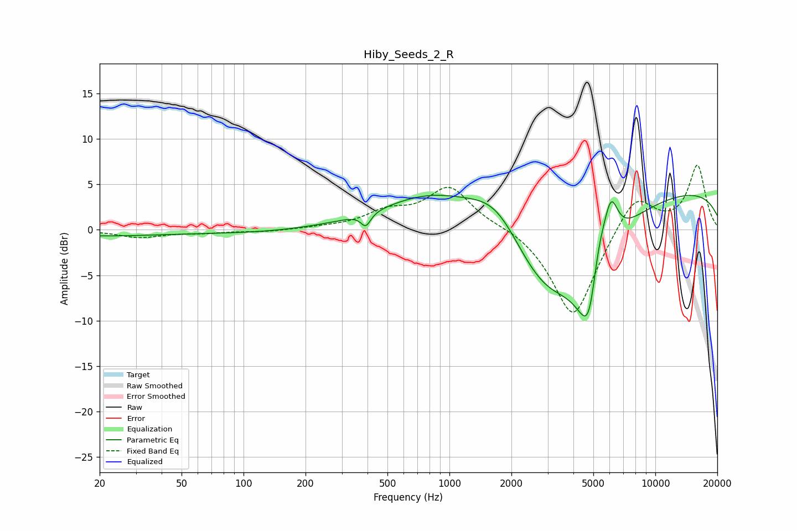

# Hiby_Seeds_2_R
See [usage instructions](https://github.com/jaakkopasanen/AutoEq#usage) for more options and info.

### Parametric EQs
Apply preamp of -3.9 dB when using parametric equalizer.

|   # | Type    |   Fc (Hz) |    Q |   Gain (dB) |
|-----|---------|-----------|------|-------------|
|   1 | Peaking |        20 | 0.41 |        -0.6 |
|   2 | Peaking |       116 | 0.55 |        -0.3 |
|   3 | Peaking |       393 | 5.97 |        -1.4 |
|   4 | Peaking |       836 | 0.57 |         4.2 |
|   5 | Peaking |      1707 | 0.98 |         5.3 |
|   6 | Peaking |      2902 | 0.61 |       -10.8 |
|   7 | Peaking |      4809 | 2.26 |       -12.3 |
|   8 | Peaking |      5244 | 2.93 |         6.6 |
|   9 | Peaking |      6090 | 3.89 |         5   |
|  10 | Peaking |     10000 | 0.18 |         4.7 |

### Fixed Band EQs
When using fixed band (also called graphic) equalizer, apply preamp of **-7.2 dB** (if available) and set gains manually with these parameters.

|   # | Type    |   Fc (Hz) |    Q |   Gain (dB) |
|-----|---------|-----------|------|-------------|
|   1 | Peaking |        31 | 1.41 |        -0.8 |
|   2 | Peaking |        62 | 1.41 |        -0.3 |
|   3 | Peaking |       125 | 1.41 |        -0.2 |
|   4 | Peaking |       250 | 1.41 |         0.2 |
|   5 | Peaking |       500 | 1.41 |         1.7 |
|   6 | Peaking |      1000 | 1.41 |         4.6 |
|   7 | Peaking |      2000 | 1.41 |         0.5 |
|   8 | Peaking |      4000 | 1.41 |       -10   |
|   9 | Peaking |      8000 | 1.41 |         4.2 |
|  10 | Peaking |     16000 | 1.41 |         7   |

### Graphs

