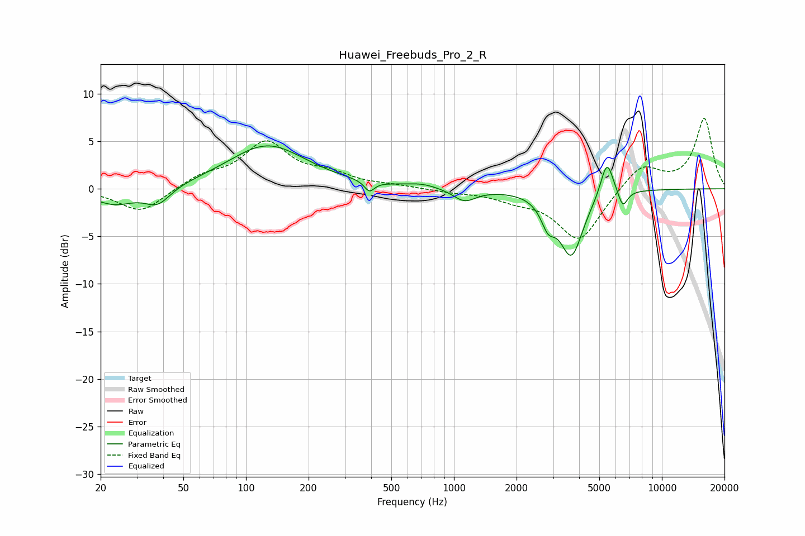

# Huawei_Freebuds_Pro_2_R
See [usage instructions](https://github.com/jaakkopasanen/AutoEq#usage) for more options and info.

### Parametric EQs
Apply preamp of -4.6 dB when using parametric equalizer.

|   # | Type    |   Fc (Hz) |    Q |   Gain (dB) |
|-----|---------|-----------|------|-------------|
|   1 | Peaking |        23 | 1.39 |        -1.7 |
|   2 | Peaking |        38 | 2.35 |        -1.8 |
|   3 | Peaking |       127 | 0.76 |         4.6 |
|   4 | Peaking |       392 | 6    |        -1.1 |
|   5 | Peaking |       703 | 1.84 |         0.4 |
|   6 | Peaking |      1124 | 2.57 |        -1.3 |
|   7 | Peaking |      2834 | 4.19 |        -2.4 |
|   8 | Peaking |      3671 | 2.48 |        -6.8 |
|   9 | Peaking |      5441 | 4.55 |         3.9 |
|  10 | Peaking |      6485 | 6    |        -1.8 |

### Fixed Band EQs
When using fixed band (also called graphic) equalizer, apply preamp of **-7.5 dB** (if available) and set gains manually with these parameters.

|   # | Type    |   Fc (Hz) |    Q |   Gain (dB) |
|-----|---------|-----------|------|-------------|
|   1 | Peaking |        31 | 1.41 |        -2.5 |
|   2 | Peaking |        62 | 1.41 |         1.2 |
|   3 | Peaking |       125 | 1.41 |         4.7 |
|   4 | Peaking |       250 | 1.41 |         1.3 |
|   5 | Peaking |       500 | 1.41 |         0.3 |
|   6 | Peaking |      1000 | 1.41 |        -0.3 |
|   7 | Peaking |      2000 | 1.41 |        -0.9 |
|   8 | Peaking |      4000 | 1.41 |        -5.5 |
|   9 | Peaking |      8000 | 1.41 |         2.6 |
|  10 | Peaking |     16000 | 1.41 |         7.4 |

### Graphs

