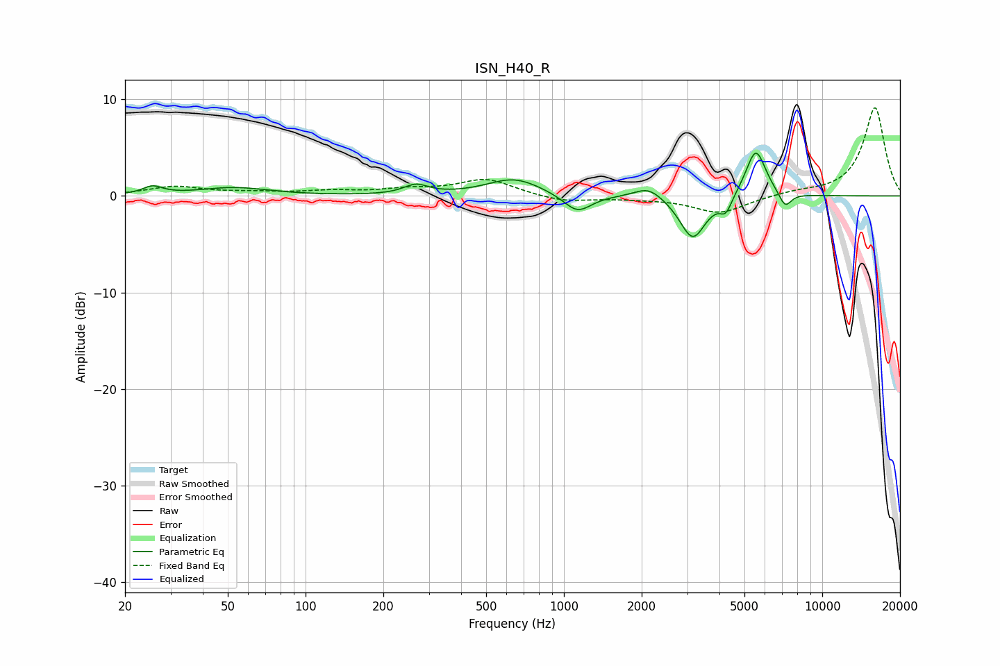

# ISN_H40_R
See [usage instructions](https://github.com/jaakkopasanen/AutoEq#usage) for more options and info.

### Parametric EQs
Apply preamp of -4.5 dB when using parametric equalizer.

|   # | Type    |   Fc (Hz) |    Q |   Gain (dB) |
|-----|---------|-----------|------|-------------|
|   1 | Peaking |        26 | 3.78 |         0.8 |
|   2 | Peaking |        53 | 1.06 |         0.8 |
|   3 | Peaking |       268 | 3.05 |         1   |
|   4 | Peaking |       642 | 1.34 |         1.8 |
|   5 | Peaking |      1128 | 2.62 |        -1.9 |
|   6 | Peaking |      2126 | 2.59 |         1.2 |
|   7 | Peaking |      3155 | 2.8  |        -4.5 |
|   8 | Peaking |      4236 | 5.97 |        -1.6 |
|   9 | Peaking |      5532 | 3.56 |         5   |
|  10 | Peaking |      7184 | 5.56 |        -1.6 |

### Fixed Band EQs
When using fixed band (also called graphic) equalizer, apply preamp of **-9.2 dB** (if available) and set gains manually with these parameters.

|   # | Type    |   Fc (Hz) |    Q |   Gain (dB) |
|-----|---------|-----------|------|-------------|
|   1 | Peaking |        31 | 1.41 |         0.9 |
|   2 | Peaking |        62 | 1.41 |         0.3 |
|   3 | Peaking |       125 | 1.41 |         0.4 |
|   4 | Peaking |       250 | 1.41 |         0.6 |
|   5 | Peaking |       500 | 1.41 |         1.7 |
|   6 | Peaking |      1000 | 1.41 |        -0.6 |
|   7 | Peaking |      2000 | 1.41 |        -0.2 |
|   8 | Peaking |      4000 | 1.41 |        -1.8 |
|   9 | Peaking |      8000 | 1.41 |         0.4 |
|  10 | Peaking |     16000 | 1.41 |         9.2 |

### Graphs

