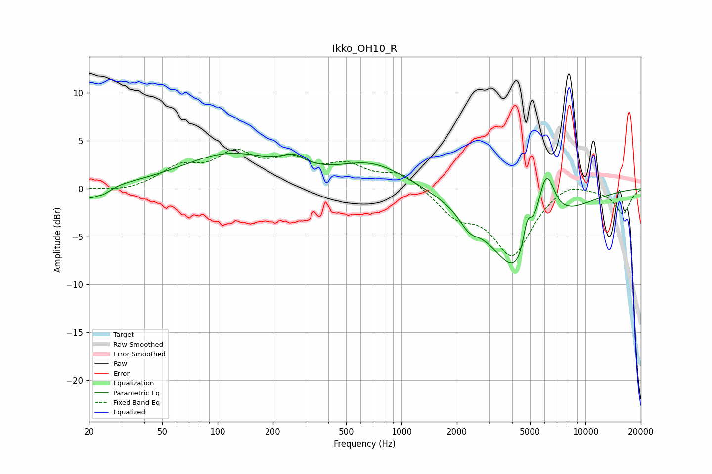

# Ikko_OH10_R
See [usage instructions](https://github.com/jaakkopasanen/AutoEq#usage) for more options and info.

### Parametric EQs
Apply preamp of -3.8 dB when using parametric equalizer.

|   # | Type    |   Fc (Hz) |    Q |   Gain (dB) |
|-----|---------|-----------|------|-------------|
|   1 | Peaking |        20 | 5.89 |        -0.8 |
|   2 | Peaking |        24 | 2.96 |        -0.9 |
|   3 | Peaking |       115 | 0.55 |         3.5 |
|   4 | Peaking |       260 | 2.12 |         1.2 |
|   5 | Peaking |       695 | 0.75 |         2.6 |
|   6 | Peaking |      2324 | 2.79 |        -1.4 |
|   7 | Peaking |      4480 | 0.88 |       -10.2 |
|   8 | Peaking |      4833 | 5.6  |         3.5 |
|   9 | Peaking |      6071 | 2.46 |         7.8 |
|  10 | Peaking |      7286 | 6    |        -0.1 |

### Fixed Band EQs
When using fixed band (also called graphic) equalizer, apply preamp of **-4.2 dB** (if available) and set gains manually with these parameters.

|   # | Type    |   Fc (Hz) |    Q |   Gain (dB) |
|-----|---------|-----------|------|-------------|
|   1 | Peaking |        31 | 1.41 |        -0.4 |
|   2 | Peaking |        62 | 1.41 |         2   |
|   3 | Peaking |       125 | 1.41 |         3.2 |
|   4 | Peaking |       250 | 1.41 |         2.5 |
|   5 | Peaking |       500 | 1.41 |         2.1 |
|   6 | Peaking |      1000 | 1.41 |         1.7 |
|   7 | Peaking |      2000 | 1.41 |        -2.5 |
|   8 | Peaking |      4000 | 1.41 |        -6.7 |
|   9 | Peaking |      8000 | 1.41 |         1   |
|  10 | Peaking |     16000 | 1.41 |        -2.6 |

### Graphs

