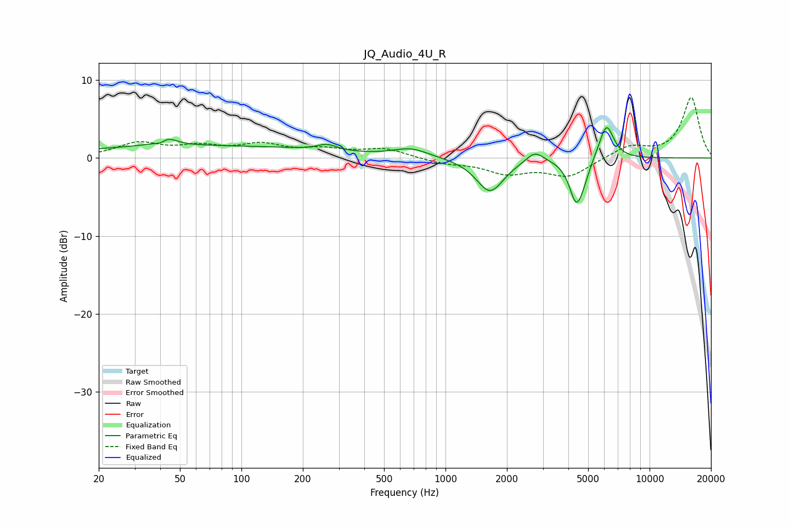

# JQ_Audio_4U_R
See [usage instructions](https://github.com/jaakkopasanen/AutoEq#usage) for more options and info.

### Parametric EQs
Apply preamp of -4.0 dB when using parametric equalizer.

|   # | Type    |   Fc (Hz) |    Q |   Gain (dB) |
|-----|---------|-----------|------|-------------|
|   1 | Peaking |        41 | 4.13 |        -1.6 |
|   2 | Peaking |        42 | 3.24 |         2.2 |
|   3 | Peaking |        62 | 0.21 |         1.6 |
|   4 | Peaking |       263 | 2.95 |         0.8 |
|   5 | Peaking |       677 | 1.66 |         1.1 |
|   6 | Peaking |      1653 | 2.11 |        -4.4 |
|   7 | Peaking |      2743 | 3.29 |         1.4 |
|   8 | Peaking |      4369 | 4.12 |        -5.3 |
|   9 | Peaking |      4741 | 4.48 |        -1.3 |
|  10 | Peaking |      6144 | 3.84 |         4.6 |

### Fixed Band EQs
When using fixed band (also called graphic) equalizer, apply preamp of **-7.9 dB** (if available) and set gains manually with these parameters.

|   # | Type    |   Fc (Hz) |    Q |   Gain (dB) |
|-----|---------|-----------|------|-------------|
|   1 | Peaking |        31 | 1.41 |         1.8 |
|   2 | Peaking |        62 | 1.41 |         1.2 |
|   3 | Peaking |       125 | 1.41 |         1.5 |
|   4 | Peaking |       250 | 1.41 |         0.9 |
|   5 | Peaking |       500 | 1.41 |         1.2 |
|   6 | Peaking |      1000 | 1.41 |        -0.6 |
|   7 | Peaking |      2000 | 1.41 |        -1.8 |
|   8 | Peaking |      4000 | 1.41 |        -2.3 |
|   9 | Peaking |      8000 | 1.41 |         1.5 |
|  10 | Peaking |     16000 | 1.41 |         7.8 |

### Graphs

