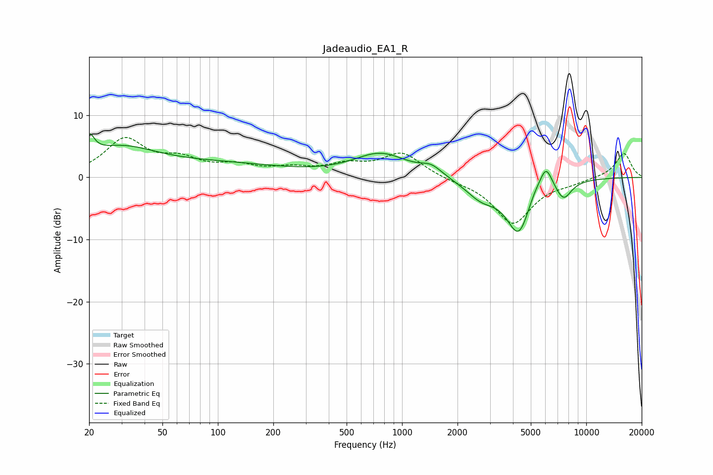

# Jadeaudio_EA1_R
See [usage instructions](https://github.com/jaakkopasanen/AutoEq#usage) for more options and info.

### Parametric EQs
Apply preamp of -7.1 dB when using parametric equalizer.

|   # | Type    |   Fc (Hz) |    Q |   Gain (dB) |
|-----|---------|-----------|------|-------------|
|   1 | Peaking |        20 | 5.13 |         3.3 |
|   2 | Peaking |        29 | 0.7  |         4.3 |
|   3 | Peaking |       108 | 0.41 |         1.9 |
|   4 | Peaking |       767 | 0.97 |         3.7 |
|   5 | Peaking |      1441 | 2.51 |         1.4 |
|   6 | Peaking |      2694 | 1.6  |        -2.8 |
|   7 | Peaking |      4306 | 2.05 |        -8.8 |
|   8 | Peaking |      5207 | 3.1  |         1.6 |
|   9 | Peaking |      6041 | 3.9  |         3.9 |
|  10 | Peaking |      7531 | 3.12 |        -2.9 |

### Fixed Band EQs
When using fixed band (also called graphic) equalizer, apply preamp of **-6.5 dB** (if available) and set gains manually with these parameters.

|   # | Type    |   Fc (Hz) |    Q |   Gain (dB) |
|-----|---------|-----------|------|-------------|
|   1 | Peaking |        31 | 1.41 |         5.9 |
|   2 | Peaking |        62 | 1.41 |         2.4 |
|   3 | Peaking |       125 | 1.41 |         1.5 |
|   4 | Peaking |       250 | 1.41 |         1.2 |
|   5 | Peaking |       500 | 1.41 |         1.7 |
|   6 | Peaking |      1000 | 1.41 |         3.8 |
|   7 | Peaking |      2000 | 1.41 |        -0.4 |
|   8 | Peaking |      4000 | 1.41 |        -7.4 |
|   9 | Peaking |      8000 | 1.41 |        -0.6 |
|  10 | Peaking |     16000 | 1.41 |         3.9 |

### Graphs

