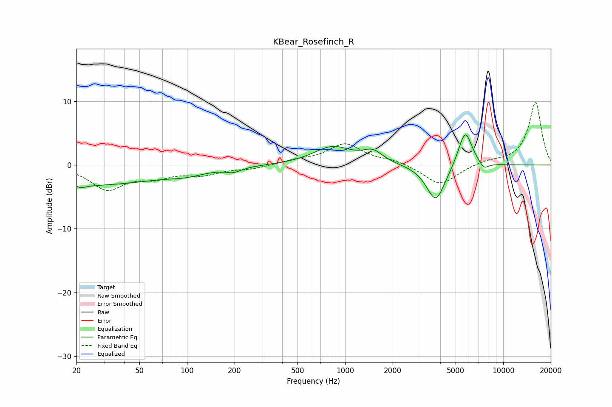

# KBear_Rosefinch_R
See [usage instructions](https://github.com/jaakkopasanen/AutoEq#usage) for more options and info.

### Parametric EQs
Apply preamp of -4.8 dB when using parametric equalizer.

|   # | Type    |   Fc (Hz) |    Q |   Gain (dB) |
|-----|---------|-----------|------|-------------|
|   1 | Peaking |        20 | 5.92 |         2.8 |
|   2 | Peaking |        20 | 5.05 |        -3.1 |
|   3 | Peaking |        23 | 0.29 |        -3.1 |
|   4 | Peaking |       100 | 1.31 |        -0.7 |
|   5 | Peaking |       197 | 2.91 |        -0.7 |
|   6 | Peaking |       835 | 1.17 |         2.8 |
|   7 | Peaking |      1499 | 2.3  |         1.7 |
|   8 | Peaking |      3747 | 2.35 |        -5.9 |
|   9 | Peaking |      5746 | 3.13 |         5.8 |
|  10 | Peaking |      7553 | 4.44 |        -1.1 |

### Fixed Band EQs
When using fixed band (also called graphic) equalizer, apply preamp of **-9.9 dB** (if available) and set gains manually with these parameters.

|   # | Type    |   Fc (Hz) |    Q |   Gain (dB) |
|-----|---------|-----------|------|-------------|
|   1 | Peaking |        31 | 1.41 |        -3.7 |
|   2 | Peaking |        62 | 1.41 |        -1.6 |
|   3 | Peaking |       125 | 1.41 |        -1.3 |
|   4 | Peaking |       250 | 1.41 |        -0.5 |
|   5 | Peaking |       500 | 1.41 |         0.6 |
|   6 | Peaking |      1000 | 1.41 |         3.2 |
|   7 | Peaking |      2000 | 1.41 |         0.7 |
|   8 | Peaking |      4000 | 1.41 |        -3.2 |
|   9 | Peaking |      8000 | 1.41 |         0.6 |
|  10 | Peaking |     16000 | 1.41 |         9.9 |

### Graphs

