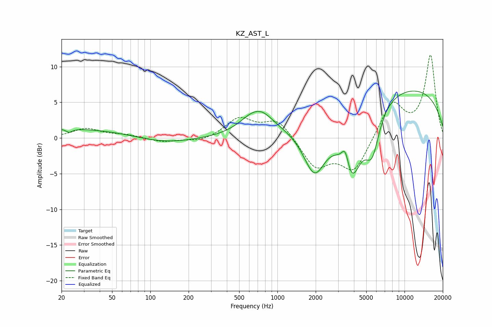

# KZ_AST_L
See [usage instructions](https://github.com/jaakkopasanen/AutoEq#usage) for more options and info.

### Parametric EQs
Apply preamp of -6.7 dB when using parametric equalizer.

|   # | Type    |   Fc (Hz) |    Q |   Gain (dB) |
|-----|---------|-----------|------|-------------|
|   1 | Peaking |        20 | 0.19 |         1.4 |
|   2 | Peaking |        23 | 5.67 |        -0.5 |
|   3 | Peaking |       122 | 0.6  |        -1.1 |
|   4 | Peaking |       680 | 2.22 |        -0.7 |
|   5 | Peaking |       695 | 1.31 |         4.2 |
|   6 | Peaking |      1961 | 1.53 |        -7.3 |
|   7 | Peaking |      3423 | 4.68 |         3.3 |
|   8 | Peaking |      3795 | 1.62 |       -10.1 |
|   9 | Peaking |      5564 | 2.4  |        -5.9 |
|  10 | Peaking |      8601 | 0.2  |         7.4 |

### Fixed Band EQs
When using fixed band (also called graphic) equalizer, apply preamp of **-11.7 dB** (if available) and set gains manually with these parameters.

|   # | Type    |   Fc (Hz) |    Q |   Gain (dB) |
|-----|---------|-----------|------|-------------|
|   1 | Peaking |        31 | 1.41 |         1.3 |
|   2 | Peaking |        62 | 1.41 |         0.4 |
|   3 | Peaking |       125 | 1.41 |        -0.6 |
|   4 | Peaking |       250 | 1.41 |        -0.6 |
|   5 | Peaking |       500 | 1.41 |         2.7 |
|   6 | Peaking |      1000 | 1.41 |         2.6 |
|   7 | Peaking |      2000 | 1.41 |        -4   |
|   8 | Peaking |      4000 | 1.41 |        -4.6 |
|   9 | Peaking |      8000 | 1.41 |         5   |
|  10 | Peaking |     16000 | 1.41 |        11.5 |

### Graphs

