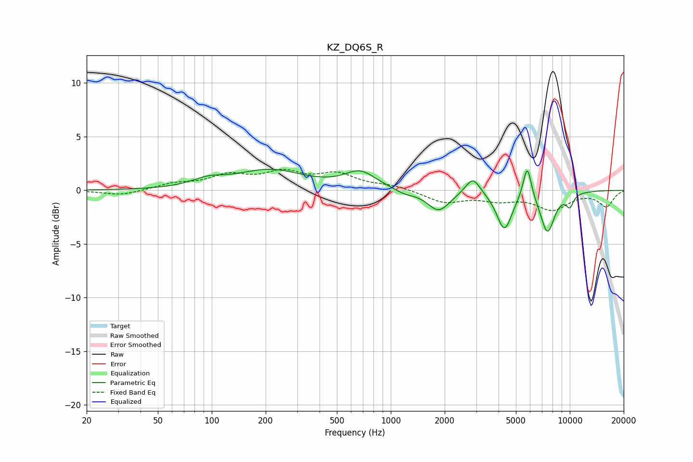

# KZ_DQ6S_R
See [usage instructions](https://github.com/jaakkopasanen/AutoEq#usage) for more options and info.

### Parametric EQs
Apply preamp of -2.1 dB when using parametric equalizer.

|   # | Type    |   Fc (Hz) |    Q |   Gain (dB) |
|-----|---------|-----------|------|-------------|
|   1 | Peaking |        95 | 1.56 |         0.7 |
|   2 | Peaking |       211 | 0.75 |         1.8 |
|   3 | Peaking |       675 | 1.62 |         1.6 |
|   4 | Peaking |      1195 | 2.47 |        -0.4 |
|   5 | Peaking |      1849 | 2.27 |        -1.9 |
|   6 | Peaking |      2874 | 3.47 |         1.6 |
|   7 | Peaking |      4312 | 3.29 |        -3.6 |
|   8 | Peaking |      5783 | 5.95 |         3.2 |
|   9 | Peaking |      7503 | 3.38 |        -3.8 |
|  10 | Peaking |     10000 | 5.91 |        -1.1 |

### Fixed Band EQs
When using fixed band (also called graphic) equalizer, apply preamp of **-2.1 dB** (if available) and set gains manually with these parameters.

|   # | Type    |   Fc (Hz) |    Q |   Gain (dB) |
|-----|---------|-----------|------|-------------|
|   1 | Peaking |        31 | 1.41 |        -0.5 |
|   2 | Peaking |        62 | 1.41 |         0.5 |
|   3 | Peaking |       125 | 1.41 |         1.2 |
|   4 | Peaking |       250 | 1.41 |         1.5 |
|   5 | Peaking |       500 | 1.41 |         1.4 |
|   6 | Peaking |      1000 | 1.41 |         0.4 |
|   7 | Peaking |      2000 | 1.41 |        -1.1 |
|   8 | Peaking |      4000 | 1.41 |        -0.8 |
|   9 | Peaking |      8000 | 1.41 |        -1.7 |
|  10 | Peaking |     16000 | 1.41 |        -1.5 |

### Graphs

