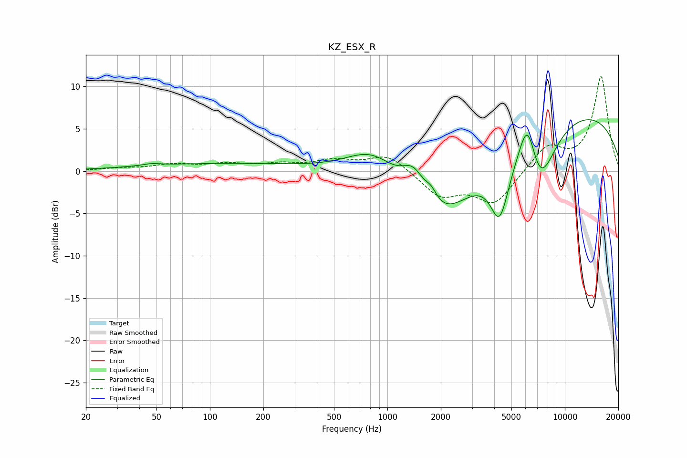

# KZ_ESX_R
See [usage instructions](https://github.com/jaakkopasanen/AutoEq#usage) for more options and info.

### Parametric EQs
Apply preamp of -6.2 dB when using parametric equalizer.

|   # | Type    |   Fc (Hz) |    Q |   Gain (dB) |
|-----|---------|-----------|------|-------------|
|   1 | Peaking |        47 | 3.02 |         0.2 |
|   2 | Peaking |       128 | 0.26 |         0.9 |
|   3 | Peaking |       838 | 0.89 |         4.6 |
|   4 | Peaking |      1406 | 2.04 |         4   |
|   5 | Peaking |      1764 | 4    |         1.5 |
|   6 | Peaking |      1897 | 0.57 |       -10   |
|   7 | Peaking |      4291 | 2.58 |        -6.9 |
|   8 | Peaking |      6173 | 2.62 |         6.9 |
|   9 | Peaking |      7131 | 1.51 |        -8.2 |
|  10 | Peaking |      8854 | 0.2  |         7.8 |

### Fixed Band EQs
When using fixed band (also called graphic) equalizer, apply preamp of **-11.3 dB** (if available) and set gains manually with these parameters.

|   # | Type    |   Fc (Hz) |    Q |   Gain (dB) |
|-----|---------|-----------|------|-------------|
|   1 | Peaking |        31 | 1.41 |         0.3 |
|   2 | Peaking |        62 | 1.41 |         0.7 |
|   3 | Peaking |       125 | 1.41 |         0.7 |
|   4 | Peaking |       250 | 1.41 |         0.7 |
|   5 | Peaking |       500 | 1.41 |         1.1 |
|   6 | Peaking |      1000 | 1.41 |         2   |
|   7 | Peaking |      2000 | 1.41 |        -2.9 |
|   8 | Peaking |      4000 | 1.41 |        -3.8 |
|   9 | Peaking |      8000 | 1.41 |         2.9 |
|  10 | Peaking |     16000 | 1.41 |        11.1 |

### Graphs

