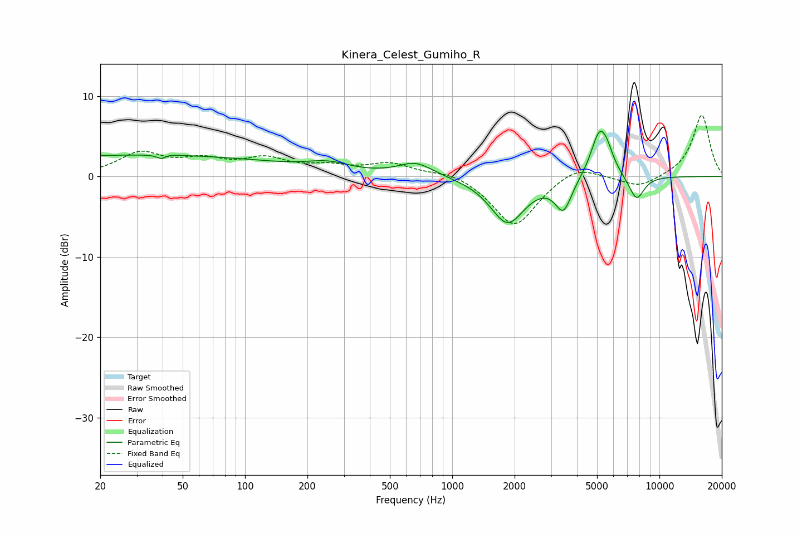

# Kinera_Celest_Gumiho_R
See [usage instructions](https://github.com/jaakkopasanen/AutoEq#usage) for more options and info.

### Parametric EQs
Apply preamp of -5.7 dB when using parametric equalizer.

|   # | Type    |   Fc (Hz) |    Q |   Gain (dB) |
|-----|---------|-----------|------|-------------|
|   1 | Peaking |        31 | 0.18 |         2.7 |
|   2 | Peaking |        40 | 5.39 |        -2.5 |
|   3 | Peaking |        40 | 4.89 |         2.1 |
|   4 | Peaking |       252 | 1.38 |         1   |
|   5 | Peaking |       667 | 1.69 |         1.7 |
|   6 | Peaking |      1849 | 1.69 |        -5.8 |
|   7 | Peaking |      3439 | 3.58 |        -3.9 |
|   8 | Peaking |      5114 | 3.35 |         5.2 |
|   9 | Peaking |      5579 | 4.09 |         1.8 |
|  10 | Peaking |      7755 | 3.61 |        -3   |

### Fixed Band EQs
When using fixed band (also called graphic) equalizer, apply preamp of **-7.7 dB** (if available) and set gains manually with these parameters.

|   # | Type    |   Fc (Hz) |    Q |   Gain (dB) |
|-----|---------|-----------|------|-------------|
|   1 | Peaking |        31 | 1.41 |         2.7 |
|   2 | Peaking |        62 | 1.41 |         1.7 |
|   3 | Peaking |       125 | 1.41 |         1.9 |
|   4 | Peaking |       250 | 1.41 |         1   |
|   5 | Peaking |       500 | 1.41 |         1.5 |
|   6 | Peaking |      1000 | 1.41 |         0.7 |
|   7 | Peaking |      2000 | 1.41 |        -6.3 |
|   8 | Peaking |      4000 | 1.41 |         1.6 |
|   9 | Peaking |      8000 | 1.41 |        -1.4 |
|  10 | Peaking |     16000 | 1.41 |         7.7 |

### Graphs

