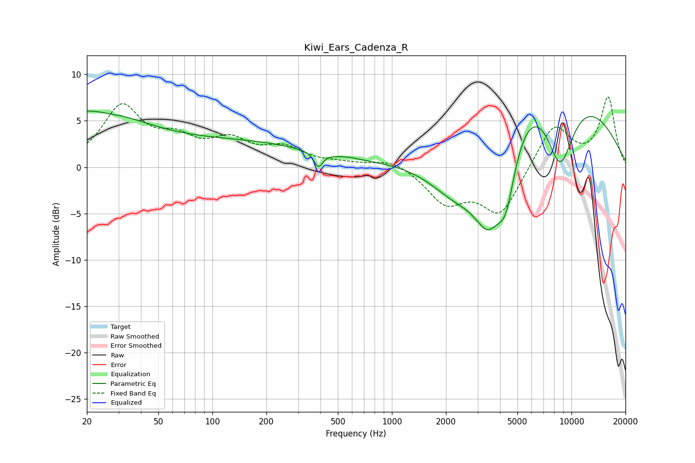

# Kiwi_Ears_Cadenza_R
See [usage instructions](https://github.com/jaakkopasanen/AutoEq#usage) for more options and info.

### Parametric EQs
Apply preamp of -6.1 dB when using parametric equalizer.

|   # | Type    |   Fc (Hz) |    Q |   Gain (dB) |
|-----|---------|-----------|------|-------------|
|   1 | Peaking |        20 | 0.41 |         5.8 |
|   2 | Peaking |        27 | 3.25 |        -0.1 |
|   3 | Peaking |       162 | 0.37 |         2.3 |
|   4 | Peaking |       389 | 5.92 |        -1.6 |
|   5 | Peaking |       590 | 2.86 |         0.1 |
|   6 | Peaking |      2331 | 0.77 |        -7   |
|   7 | Peaking |      3448 | 1.54 |        -8.6 |
|   8 | Peaking |      4321 | 2.67 |        -6   |
|   9 | Peaking |      6593 | 0.33 |        12.8 |
|  10 | Peaking |      8619 | 1.47 |        -9.8 |

### Fixed Band EQs
When using fixed band (also called graphic) equalizer, apply preamp of **-7.7 dB** (if available) and set gains manually with these parameters.

|   # | Type    |   Fc (Hz) |    Q |   Gain (dB) |
|-----|---------|-----------|------|-------------|
|   1 | Peaking |        31 | 1.41 |         6.3 |
|   2 | Peaking |        62 | 1.41 |         2.4 |
|   3 | Peaking |       125 | 1.41 |         2.5 |
|   4 | Peaking |       250 | 1.41 |         1.8 |
|   5 | Peaking |       500 | 1.41 |         0.3 |
|   6 | Peaking |      1000 | 1.41 |         1   |
|   7 | Peaking |      2000 | 1.41 |        -3.6 |
|   8 | Peaking |      4000 | 1.41 |        -5   |
|   9 | Peaking |      8000 | 1.41 |         4.7 |
|  10 | Peaking |     16000 | 1.41 |         7.4 |

### Graphs

