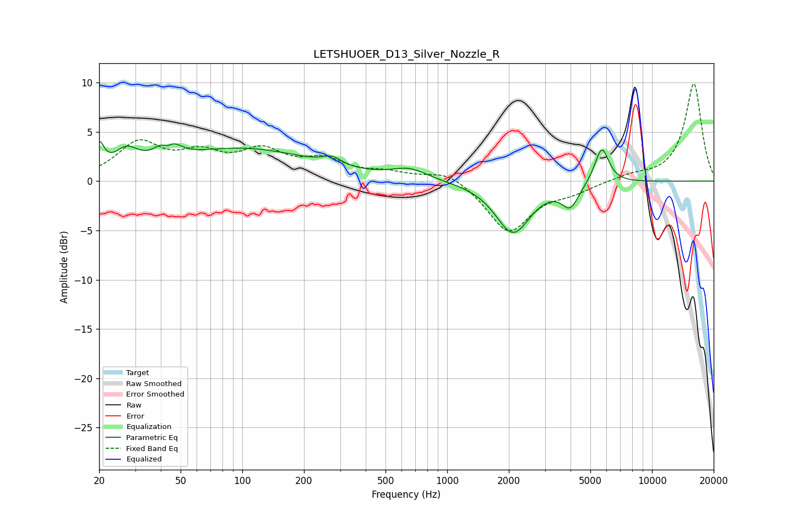

# LETSHUOER_D13_Silver_Nozzle_R
See [usage instructions](https://github.com/jaakkopasanen/AutoEq#usage) for more options and info.

### Parametric EQs
Apply preamp of -4.1 dB when using parametric equalizer.

|   # | Type    |   Fc (Hz) |    Q |   Gain (dB) |
|-----|---------|-----------|------|-------------|
|   1 | Peaking |        20 | 5.96 |         2.6 |
|   2 | Peaking |        27 | 2.42 |         2.1 |
|   3 | Peaking |        43 | 5    |        -2.1 |
|   4 | Peaking |        43 | 3.32 |         3.4 |
|   5 | Peaking |       100 | 0.41 |         3.2 |
|   6 | Peaking |       274 | 3.12 |         0.8 |
|   7 | Peaking |       655 | 1.65 |         1.1 |
|   8 | Peaking |      2095 | 1.67 |        -5.2 |
|   9 | Peaking |      3992 | 3.41 |        -2.3 |
|  10 | Peaking |      5682 | 3.99 |         3.7 |

### Fixed Band EQs
When using fixed band (also called graphic) equalizer, apply preamp of **-10.0 dB** (if available) and set gains manually with these parameters.

|   # | Type    |   Fc (Hz) |    Q |   Gain (dB) |
|-----|---------|-----------|------|-------------|
|   1 | Peaking |        31 | 1.41 |         3.6 |
|   2 | Peaking |        62 | 1.41 |         2.3 |
|   3 | Peaking |       125 | 1.41 |         2.7 |
|   4 | Peaking |       250 | 1.41 |         1.9 |
|   5 | Peaking |       500 | 1.41 |         0.7 |
|   6 | Peaking |      1000 | 1.41 |         1.2 |
|   7 | Peaking |      2000 | 1.41 |        -5.2 |
|   8 | Peaking |      4000 | 1.41 |        -0.9 |
|   9 | Peaking |      8000 | 1.41 |         0.5 |
|  10 | Peaking |     16000 | 1.41 |         9.9 |

### Graphs

