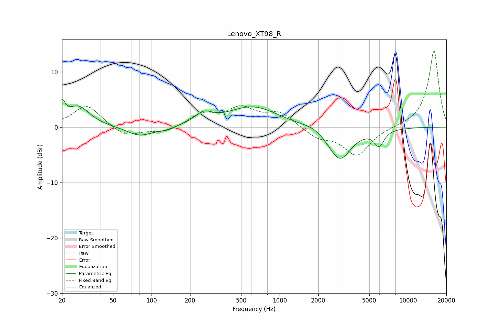

# Lenovo_XT98_R
See [usage instructions](https://github.com/jaakkopasanen/AutoEq#usage) for more options and info.

### Parametric EQs
Apply preamp of -5.1 dB when using parametric equalizer.

|   # | Type    |   Fc (Hz) |    Q |   Gain (dB) |
|-----|---------|-----------|------|-------------|
|   1 | Peaking |        20 | 5.87 |         3.1 |
|   2 | Peaking |        27 | 1.61 |         3.7 |
|   3 | Peaking |        81 | 1.46 |        -1.7 |
|   4 | Peaking |       128 | 2.04 |        -0.5 |
|   5 | Peaking |       255 | 2.15 |         1.8 |
|   6 | Peaking |       617 | 0.72 |         3.7 |
|   7 | Peaking |      1852 | 1.81 |         0.6 |
|   8 | Peaking |      2837 | 3.62 |         0   |
|   9 | Peaking |      2939 | 1.58 |        -6   |
|  10 | Peaking |      5972 | 3.57 |        -2.8 |

### Fixed Band EQs
When using fixed band (also called graphic) equalizer, apply preamp of **-13.8 dB** (if available) and set gains manually with these parameters.

|   # | Type    |   Fc (Hz) |    Q |   Gain (dB) |
|-----|---------|-----------|------|-------------|
|   1 | Peaking |        31 | 1.41 |         4   |
|   2 | Peaking |        62 | 1.41 |        -1.8 |
|   3 | Peaking |       125 | 1.41 |        -1   |
|   4 | Peaking |       250 | 1.41 |         2.2 |
|   5 | Peaking |       500 | 1.41 |         3.1 |
|   6 | Peaking |      1000 | 1.41 |         2.5 |
|   7 | Peaking |      2000 | 1.41 |        -1.8 |
|   8 | Peaking |      4000 | 1.41 |        -5   |
|   9 | Peaking |      8000 | 1.41 |         0   |
|  10 | Peaking |     16000 | 1.41 |        13.9 |

### Graphs

