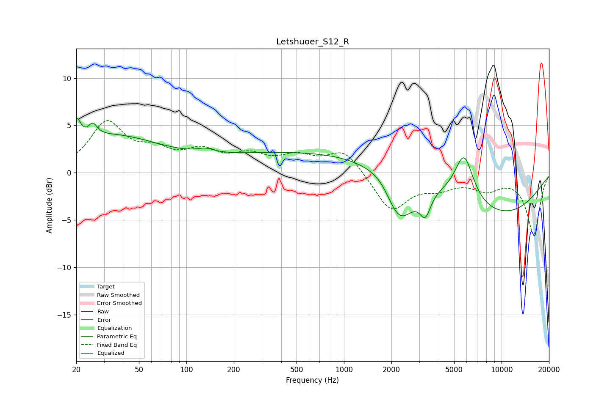

# Letshuoer_S12_R
See [usage instructions](https://github.com/jaakkopasanen/AutoEq#usage) for more options and info.

### Parametric EQs
Apply preamp of -5.8 dB when using parametric equalizer.

|   # | Type    |   Fc (Hz) |    Q |   Gain (dB) |
|-----|---------|-----------|------|-------------|
|   1 | Peaking |        20 | 5.52 |         2.4 |
|   2 | Peaking |        25 | 5.29 |         1.3 |
|   3 | Peaking |        33 | 0.43 |         3.8 |
|   4 | Peaking |       133 | 2.54 |         0.5 |
|   5 | Peaking |       779 | 0.18 |         2.3 |
|   6 | Peaking |      1755 | 1.86 |         0.9 |
|   7 | Peaking |      2239 | 1.47 |        -5.6 |
|   8 | Peaking |      3282 | 4.04 |        -2.5 |
|   9 | Peaking |      5781 | 2.36 |         5   |
|  10 | Peaking |      9391 | 0.39 |        -4.6 |

### Fixed Band EQs
When using fixed band (also called graphic) equalizer, apply preamp of **-5.6 dB** (if available) and set gains manually with these parameters.

|   # | Type    |   Fc (Hz) |    Q |   Gain (dB) |
|-----|---------|-----------|------|-------------|
|   1 | Peaking |        31 | 1.41 |         5.1 |
|   2 | Peaking |        62 | 1.41 |         1.8 |
|   3 | Peaking |       125 | 1.41 |         1.9 |
|   4 | Peaking |       250 | 1.41 |         1.5 |
|   5 | Peaking |       500 | 1.41 |         1.5 |
|   6 | Peaking |      1000 | 1.41 |         2.4 |
|   7 | Peaking |      2000 | 1.41 |        -4   |
|   8 | Peaking |      4000 | 1.41 |        -1.3 |
|   9 | Peaking |      8000 | 1.41 |        -1.5 |
|  10 | Peaking |     16000 | 1.41 |        -6.5 |

### Graphs

