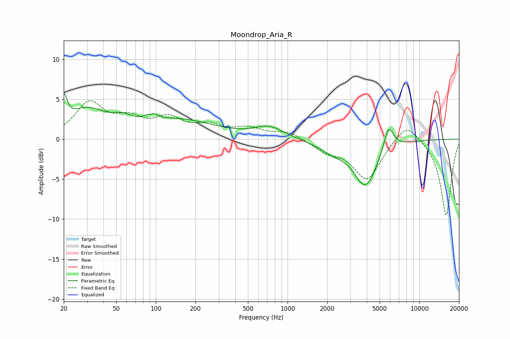

# Moondrop_Aria_R
See [usage instructions](https://github.com/jaakkopasanen/AutoEq#usage) for more options and info.

### Parametric EQs
Apply preamp of -5.8 dB when using parametric equalizer.

|   # | Type    |   Fc (Hz) |    Q |   Gain (dB) |
|-----|---------|-----------|------|-------------|
|   1 | Peaking |        20 | 5.76 |         3.3 |
|   2 | Peaking |        30 | 0.94 |         3.4 |
|   3 | Peaking |        56 | 1.97 |         1   |
|   4 | Peaking |        92 | 5.83 |        -2.2 |
|   5 | Peaking |        92 | 4.72 |         2.9 |
|   6 | Peaking |       151 | 0.51 |         2.3 |
|   7 | Peaking |       727 | 1.3  |         1.4 |
|   8 | Peaking |      2213 | 1.22 |        -1.2 |
|   9 | Peaking |      3910 | 1.6  |        -5.6 |
|  10 | Peaking |      5850 | 3.72 |         3.1 |

### Fixed Band EQs
When using fixed band (also called graphic) equalizer, apply preamp of **-4.9 dB** (if available) and set gains manually with these parameters.

|   # | Type    |   Fc (Hz) |    Q |   Gain (dB) |
|-----|---------|-----------|------|-------------|
|   1 | Peaking |        31 | 1.41 |         4.3 |
|   2 | Peaking |        62 | 1.41 |         2   |
|   3 | Peaking |       125 | 1.41 |         2.3 |
|   4 | Peaking |       250 | 1.41 |         1.4 |
|   5 | Peaking |       500 | 1.41 |         1.2 |
|   6 | Peaking |      1000 | 1.41 |         0.9 |
|   7 | Peaking |      2000 | 1.41 |        -1.3 |
|   8 | Peaking |      4000 | 1.41 |        -5   |
|   9 | Peaking |      8000 | 1.41 |         2.4 |
|  10 | Peaking |     16000 | 1.41 |        -9.6 |

### Graphs

