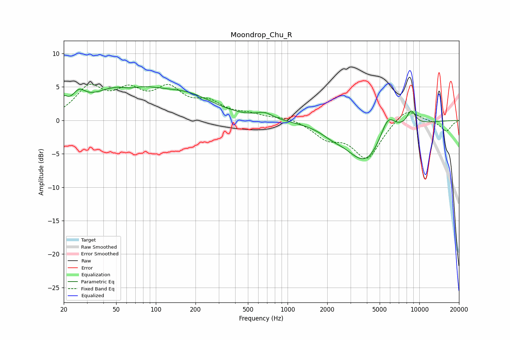

# Moondrop_Chu_R
See [usage instructions](https://github.com/jaakkopasanen/AutoEq#usage) for more options and info.

### Parametric EQs
Apply preamp of -5.1 dB when using parametric equalizer.

|   # | Type    |   Fc (Hz) |    Q |   Gain (dB) |
|-----|---------|-----------|------|-------------|
|   1 | Peaking |        20 | 5.97 |         1.4 |
|   2 | Peaking |        26 | 2.9  |         2   |
|   3 | Peaking |        59 | 0.57 |         5.1 |
|   4 | Peaking |        64 | 1.81 |        -0.9 |
|   5 | Peaking |       181 | 0.7  |         2.7 |
|   6 | Peaking |       668 | 2.33 |         0.9 |
|   7 | Peaking |      2180 | 1.71 |        -0.7 |
|   8 | Peaking |      3896 | 0.95 |        -6.2 |
|   9 | Peaking |      5762 | 2.36 |         3.5 |
|  10 | Peaking |      8666 | 3.82 |         2.2 |

### Fixed Band EQs
When using fixed band (also called graphic) equalizer, apply preamp of **-5.5 dB** (if available) and set gains manually with these parameters.

|   # | Type    |   Fc (Hz) |    Q |   Gain (dB) |
|-----|---------|-----------|------|-------------|
|   1 | Peaking |        31 | 1.41 |         4.5 |
|   2 | Peaking |        62 | 1.41 |         3.6 |
|   3 | Peaking |       125 | 1.41 |         4.1 |
|   4 | Peaking |       250 | 1.41 |         2.2 |
|   5 | Peaking |       500 | 1.41 |         0.7 |
|   6 | Peaking |      1000 | 1.41 |         0.5 |
|   7 | Peaking |      2000 | 1.41 |        -2.3 |
|   8 | Peaking |      4000 | 1.41 |        -5.6 |
|   9 | Peaking |      8000 | 1.41 |         2.1 |
|  10 | Peaking |     16000 | 1.41 |        -1.6 |

### Graphs

