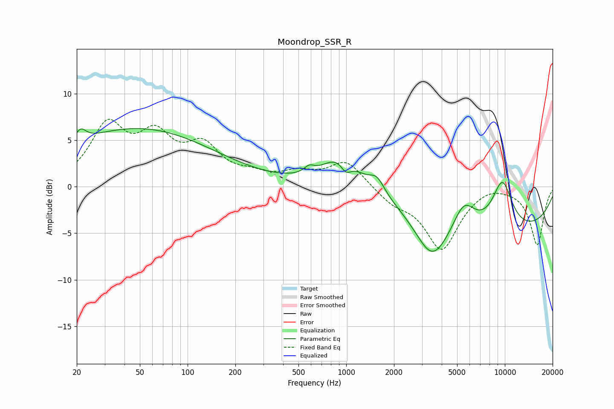

# Moondrop_SSR_R
See [usage instructions](https://github.com/jaakkopasanen/AutoEq#usage) for more options and info.

### Parametric EQs
Apply preamp of -6.3 dB when using parametric equalizer.

|   # | Type    |   Fc (Hz) |    Q |   Gain (dB) |
|-----|---------|-----------|------|-------------|
|   1 | Peaking |        21 | 4.17 |         1.4 |
|   2 | Peaking |        48 | 0.28 |         6.2 |
|   3 | Peaking |       584 | 4.38 |         0.7 |
|   4 | Peaking |       940 | 1.26 |         3.6 |
|   5 | Peaking |       995 | 3.84 |        -1.6 |
|   6 | Peaking |      1563 | 2.97 |         1.6 |
|   7 | Peaking |      3474 | 1.36 |        -4.7 |
|   8 | Peaking |      5520 | 2.03 |         3.1 |
|   9 | Peaking |      9642 | 1.91 |         5.2 |
|  10 | Peaking |      9749 | 0.24 |        -4.8 |

### Fixed Band EQs
When using fixed band (also called graphic) equalizer, apply preamp of **-7.3 dB** (if available) and set gains manually with these parameters.

|   # | Type    |   Fc (Hz) |    Q |   Gain (dB) |
|-----|---------|-----------|------|-------------|
|   1 | Peaking |        31 | 1.41 |         6.2 |
|   2 | Peaking |        62 | 1.41 |         4.7 |
|   3 | Peaking |       125 | 1.41 |         3.8 |
|   4 | Peaking |       250 | 1.41 |         0.9 |
|   5 | Peaking |       500 | 1.41 |         1.2 |
|   6 | Peaking |      1000 | 1.41 |         2.8 |
|   7 | Peaking |      2000 | 1.41 |        -1.5 |
|   8 | Peaking |      4000 | 1.41 |        -6.6 |
|   9 | Peaking |      8000 | 1.41 |         0.5 |
|  10 | Peaking |     16000 | 1.41 |        -6.2 |

### Graphs

