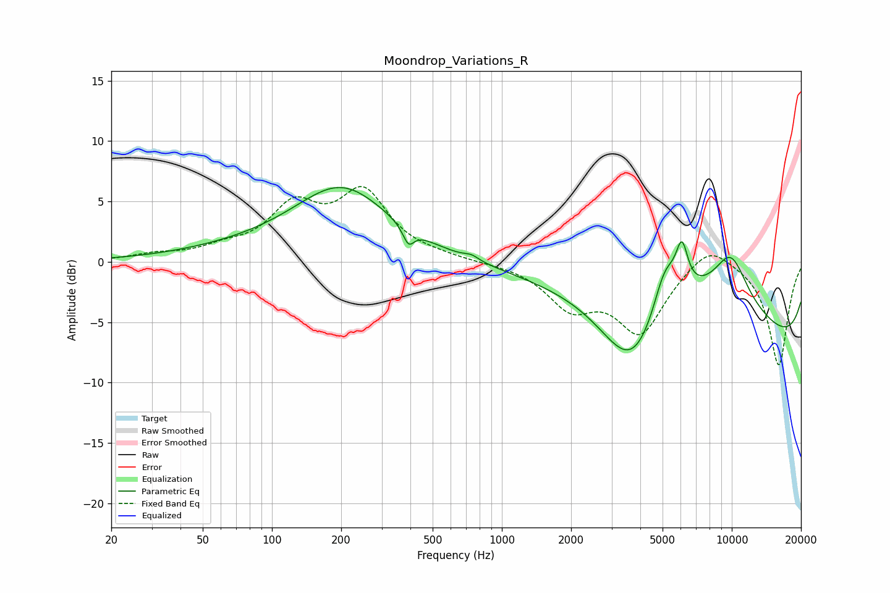

# Moondrop_Variations_R
See [usage instructions](https://github.com/jaakkopasanen/AutoEq#usage) for more options and info.

### Parametric EQs
Apply preamp of -6.2 dB when using parametric equalizer.

|   # | Type    |   Fc (Hz) |    Q |   Gain (dB) |
|-----|---------|-----------|------|-------------|
|   1 | Peaking |        74 | 0.47 |         0.7 |
|   2 | Peaking |       202 | 0.68 |         5.9 |
|   3 | Peaking |       392 | 5.86 |        -1.4 |
|   4 | Peaking |       738 | 4.38 |         0.4 |
|   5 | Peaking |      3695 | 1.02 |        -6.9 |
|   6 | Peaking |      5109 | 2.64 |         4   |
|   7 | Peaking |      6069 | 5.16 |         3.6 |
|   8 | Peaking |      7180 | 0.31 |         9.4 |
|   9 | Peaking |      9853 | 0.18 |       -11.6 |
|  10 | Peaking |      9902 | 1.72 |         3.7 |

### Fixed Band EQs
When using fixed band (also called graphic) equalizer, apply preamp of **-6.3 dB** (if available) and set gains manually with these parameters.

|   # | Type    |   Fc (Hz) |    Q |   Gain (dB) |
|-----|---------|-----------|------|-------------|
|   1 | Peaking |        31 | 1.41 |         0.5 |
|   2 | Peaking |        62 | 1.41 |         0.8 |
|   3 | Peaking |       125 | 1.41 |         4.2 |
|   4 | Peaking |       250 | 1.41 |         5.4 |
|   5 | Peaking |       500 | 1.41 |         0.3 |
|   6 | Peaking |      1000 | 1.41 |        -0.1 |
|   7 | Peaking |      2000 | 1.41 |        -3.4 |
|   8 | Peaking |      4000 | 1.41 |        -5.6 |
|   9 | Peaking |      8000 | 1.41 |         1.9 |
|  10 | Peaking |     16000 | 1.41 |        -8.6 |

### Graphs

