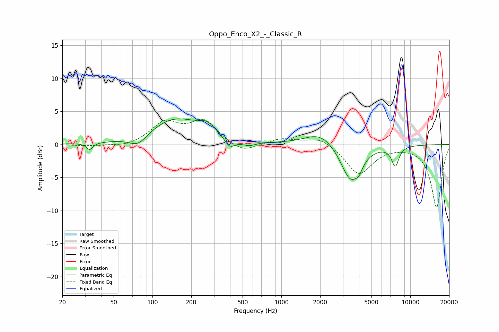

# Oppo_Enco_X2_-_Classic_R
See [usage instructions](https://github.com/jaakkopasanen/AutoEq#usage) for more options and info.

### Parametric EQs
Apply preamp of -4.0 dB when using parametric equalizer.

|   # | Type    |   Fc (Hz) |    Q |   Gain (dB) |
|-----|---------|-----------|------|-------------|
|   1 | Peaking |        33 | 6    |        -1   |
|   2 | Peaking |        77 | 1.96 |        -1.7 |
|   3 | Peaking |       149 | 0.7  |         3.9 |
|   4 | Peaking |       266 | 2.14 |         1.4 |
|   5 | Peaking |       397 | 3.48 |        -1.5 |
|   6 | Peaking |       559 | 2.66 |        -0.7 |
|   7 | Peaking |      2020 | 1.19 |         2.1 |
|   8 | Peaking |      3445 | 1.83 |        -5.7 |
|   9 | Peaking |      4001 | 5.74 |        -1   |
|  10 | Peaking |      7643 | 4.66 |        -3   |

### Fixed Band EQs
When using fixed band (also called graphic) equalizer, apply preamp of **-3.9 dB** (if available) and set gains manually with these parameters.

|   # | Type    |   Fc (Hz) |    Q |   Gain (dB) |
|-----|---------|-----------|------|-------------|
|   1 | Peaking |        31 | 1.41 |        -0.2 |
|   2 | Peaking |        62 | 1.41 |        -0.5 |
|   3 | Peaking |       125 | 1.41 |         3.2 |
|   4 | Peaking |       250 | 1.41 |         3.4 |
|   5 | Peaking |       500 | 1.41 |        -1.4 |
|   6 | Peaking |      1000 | 1.41 |         0.9 |
|   7 | Peaking |      2000 | 1.41 |         1.2 |
|   8 | Peaking |      4000 | 1.41 |        -4.5 |
|   9 | Peaking |      8000 | 1.41 |        -0   |
|  10 | Peaking |     16000 | 1.41 |        -9.5 |

### Graphs

