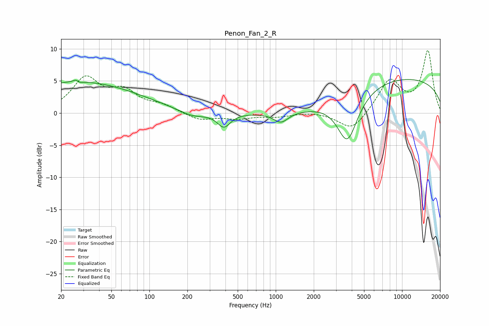

# Penon_Fan_2_R
See [usage instructions](https://github.com/jaakkopasanen/AutoEq#usage) for more options and info.

### Parametric EQs
Apply preamp of -5.3 dB when using parametric equalizer.

|   # | Type    |   Fc (Hz) |    Q |   Gain (dB) |
|-----|---------|-----------|------|-------------|
|   1 | Peaking |        25 | 0.32 |         4.6 |
|   2 | Peaking |        27 | 5.83 |         3.2 |
|   3 | Peaking |        27 | 5.77 |        -3.1 |
|   4 | Peaking |        76 | 0.5  |         0.7 |
|   5 | Peaking |       218 | 1.34 |        -1   |
|   6 | Peaking |       389 | 2.78 |        -2.2 |
|   7 | Peaking |      1100 | 2.46 |        -1.6 |
|   8 | Peaking |      3691 | 1.73 |        -7.5 |
|   9 | Peaking |      7071 | 0.18 |        -5.9 |
|  10 | Peaking |      8824 | 0.2  |        11.3 |

### Fixed Band EQs
When using fixed band (also called graphic) equalizer, apply preamp of **-9.8 dB** (if available) and set gains manually with these parameters.

|   # | Type    |   Fc (Hz) |    Q |   Gain (dB) |
|-----|---------|-----------|------|-------------|
|   1 | Peaking |        31 | 1.41 |         5.2 |
|   2 | Peaking |        62 | 1.41 |         3   |
|   3 | Peaking |       125 | 1.41 |         1.1 |
|   4 | Peaking |       250 | 1.41 |        -1.1 |
|   5 | Peaking |       500 | 1.41 |        -0.8 |
|   6 | Peaking |      1000 | 1.41 |        -0.5 |
|   7 | Peaking |      2000 | 1.41 |         0.2 |
|   8 | Peaking |      4000 | 1.41 |        -2.9 |
|   9 | Peaking |      8000 | 1.41 |         5.1 |
|  10 | Peaking |     16000 | 1.41 |         9.6 |

### Graphs

