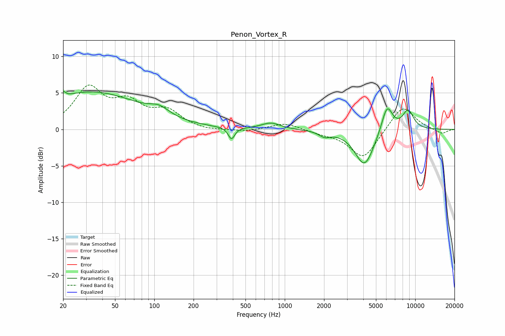

# Penon_Vortex_R
See [usage instructions](https://github.com/jaakkopasanen/AutoEq#usage) for more options and info.

### Parametric EQs
Apply preamp of -5.3 dB when using parametric equalizer.

|   # | Type    |   Fc (Hz) |    Q |   Gain (dB) |
|-----|---------|-----------|------|-------------|
|   1 | Peaking |        21 | 5.63 |         3.2 |
|   2 | Peaking |        21 | 5.73 |        -2.6 |
|   3 | Peaking |        33 | 0.37 |         5.1 |
|   4 | Peaking |       109 | 1.88 |         1.1 |
|   5 | Peaking |       390 | 5.74 |        -1.6 |
|   6 | Peaking |       782 | 2    |         0.9 |
|   7 | Peaking |      2023 | 3.27 |        -0.7 |
|   8 | Peaking |      4086 | 1.91 |        -5   |
|   9 | Peaking |      6084 | 3.19 |         3.8 |
|  10 | Peaking |      8817 | 3    |         2.6 |

### Fixed Band EQs
When using fixed band (also called graphic) equalizer, apply preamp of **-6.2 dB** (if available) and set gains manually with these parameters.

|   # | Type    |   Fc (Hz) |    Q |   Gain (dB) |
|-----|---------|-----------|------|-------------|
|   1 | Peaking |        31 | 1.41 |         5.4 |
|   2 | Peaking |        62 | 1.41 |         3.1 |
|   3 | Peaking |       125 | 1.41 |         2.3 |
|   4 | Peaking |       250 | 1.41 |        -0.3 |
|   5 | Peaking |       500 | 1.41 |        -0.3 |
|   6 | Peaking |      1000 | 1.41 |         0.9 |
|   7 | Peaking |      2000 | 1.41 |        -0.4 |
|   8 | Peaking |      4000 | 1.41 |        -4   |
|   9 | Peaking |      8000 | 1.41 |         3.4 |
|  10 | Peaking |     16000 | 1.41 |        -0.6 |

### Graphs

