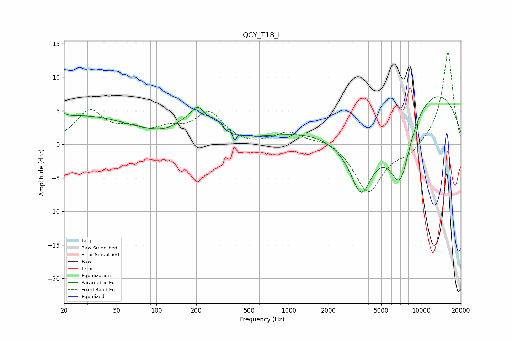

# QCY_T18_L
See [usage instructions](https://github.com/jaakkopasanen/AutoEq#usage) for more options and info.

### Parametric EQs
Apply preamp of -7.2 dB when using parametric equalizer.

|   # | Type    |   Fc (Hz) |    Q |   Gain (dB) |
|-----|---------|-----------|------|-------------|
|   1 | Peaking |        20 | 5.96 |         0.6 |
|   2 | Peaking |        27 | 0.37 |         4.2 |
|   3 | Peaking |       150 | 1.94 |         0.8 |
|   4 | Peaking |       193 | 2.97 |        -1.5 |
|   5 | Peaking |       200 | 2.23 |         5.6 |
|   6 | Peaking |       280 | 2.99 |         1.6 |
|   7 | Peaking |      3528 | 1.9  |        -6.5 |
|   8 | Peaking |      3681 | 0.47 |       -10.6 |
|   9 | Peaking |      6507 | 0.2  |        12.9 |
|  10 | Peaking |      6962 | 1.55 |       -10.6 |

### Fixed Band EQs
When using fixed band (also called graphic) equalizer, apply preamp of **-13.8 dB** (if available) and set gains manually with these parameters.

|   # | Type    |   Fc (Hz) |    Q |   Gain (dB) |
|-----|---------|-----------|------|-------------|
|   1 | Peaking |        31 | 1.41 |         4.8 |
|   2 | Peaking |        62 | 1.41 |         1.7 |
|   3 | Peaking |       125 | 1.41 |         1.8 |
|   4 | Peaking |       250 | 1.41 |         4.5 |
|   5 | Peaking |       500 | 1.41 |        -0.3 |
|   6 | Peaking |      1000 | 1.41 |         1.8 |
|   7 | Peaking |      2000 | 1.41 |         0.9 |
|   8 | Peaking |      4000 | 1.41 |        -7.2 |
|   9 | Peaking |      8000 | 1.41 |        -1.5 |
|  10 | Peaking |     16000 | 1.41 |        13.9 |

### Graphs

