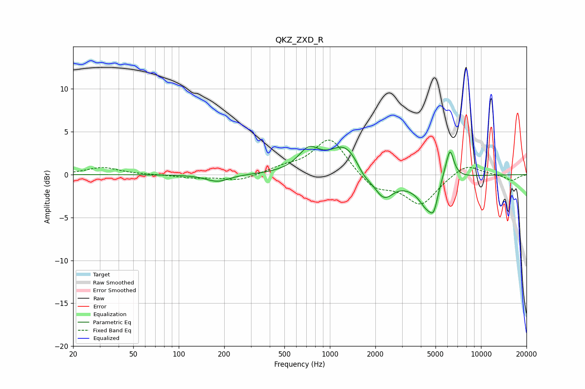

# QKZ_ZXD_R
See [usage instructions](https://github.com/jaakkopasanen/AutoEq#usage) for more options and info.

### Parametric EQs
Apply preamp of -3.4 dB when using parametric equalizer.

|   # | Type    |   Fc (Hz) |    Q |   Gain (dB) |
|-----|---------|-----------|------|-------------|
|   1 | Peaking |       181 | 1.85 |        -0.8 |
|   2 | Peaking |       725 | 2.02 |         2.5 |
|   3 | Peaking |      1267 | 1.39 |         3.4 |
|   4 | Peaking |      1681 | 2.94 |        -1   |
|   5 | Peaking |      2267 | 2.12 |        -2.8 |
|   6 | Peaking |      3952 | 2.48 |         0.9 |
|   7 | Peaking |      4401 | 1.78 |        -4.8 |
|   8 | Peaking |      4875 | 5.98 |        -1.6 |
|   9 | Peaking |      5907 | 2.57 |         1.9 |
|  10 | Peaking |      6244 | 5.9  |         2.6 |

### Fixed Band EQs
When using fixed band (also called graphic) equalizer, apply preamp of **-4.1 dB** (if available) and set gains manually with these parameters.

|   # | Type    |   Fc (Hz) |    Q |   Gain (dB) |
|-----|---------|-----------|------|-------------|
|   1 | Peaking |        31 | 1.41 |         0.8 |
|   2 | Peaking |        62 | 1.41 |         0   |
|   3 | Peaking |       125 | 1.41 |        -0.4 |
|   4 | Peaking |       250 | 1.41 |        -0.7 |
|   5 | Peaking |       500 | 1.41 |         0.7 |
|   6 | Peaking |      1000 | 1.41 |         4.3 |
|   7 | Peaking |      2000 | 1.41 |        -1.8 |
|   8 | Peaking |      4000 | 1.41 |        -3.4 |
|   9 | Peaking |      8000 | 1.41 |         1.4 |
|  10 | Peaking |     16000 | 1.41 |        -0.7 |

### Graphs

