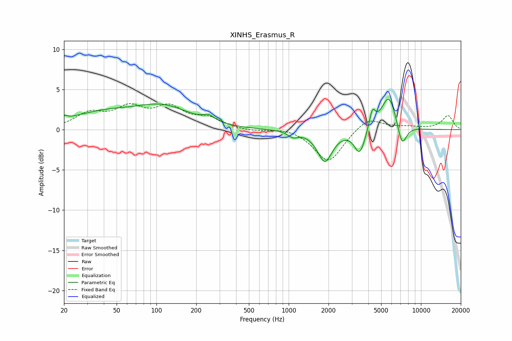

# XINHS_Erasmus_R
See [usage instructions](https://github.com/jaakkopasanen/AutoEq#usage) for more options and info.

### Parametric EQs
Apply preamp of -3.9 dB when using parametric equalizer.

|   # | Type    |   Fc (Hz) |    Q |   Gain (dB) |
|-----|---------|-----------|------|-------------|
|   1 | Peaking |        20 | 5.89 |         0.5 |
|   2 | Peaking |        39 | 0.55 |         1.9 |
|   3 | Peaking |       113 | 0.69 |         2.5 |
|   4 | Peaking |       249 | 3.15 |         0.7 |
|   5 | Peaking |      1078 | 3.81 |        -0.7 |
|   6 | Peaking |      1878 | 2.5  |        -3.9 |
|   7 | Peaking |      3446 | 3.5  |        -3.1 |
|   8 | Peaking |      4291 | 6    |         2.2 |
|   9 | Peaking |      5727 | 2.41 |         4.4 |
|  10 | Peaking |      7176 | 3.87 |        -3   |

### Fixed Band EQs
When using fixed band (also called graphic) equalizer, apply preamp of **-3.3 dB** (if available) and set gains manually with these parameters.

|   # | Type    |   Fc (Hz) |    Q |   Gain (dB) |
|-----|---------|-----------|------|-------------|
|   1 | Peaking |        31 | 1.41 |         1.8 |
|   2 | Peaking |        62 | 1.41 |         2.4 |
|   3 | Peaking |       125 | 1.41 |         2.5 |
|   4 | Peaking |       250 | 1.41 |         1.2 |
|   5 | Peaking |       500 | 1.41 |        -0.2 |
|   6 | Peaking |      1000 | 1.41 |         0.3 |
|   7 | Peaking |      2000 | 1.41 |        -4.1 |
|   8 | Peaking |      4000 | 1.41 |         1.6 |
|   9 | Peaking |      8000 | 1.41 |         0.3 |
|  10 | Peaking |     16000 | 1.41 |         1.7 |

### Graphs

