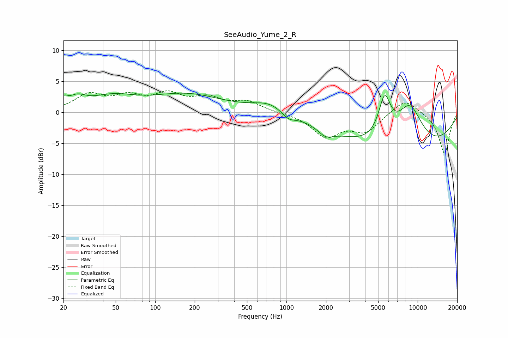

# SeeAudio_Yume_2_R
See [usage instructions](https://github.com/jaakkopasanen/AutoEq#usage) for more options and info.

### Parametric EQs
Apply preamp of -3.2 dB when using parametric equalizer.

|   # | Type    |   Fc (Hz) |    Q |   Gain (dB) |
|-----|---------|-----------|------|-------------|
|   1 | Peaking |        20 | 5.31 |         1.2 |
|   2 | Peaking |        25 | 2.22 |         1.5 |
|   3 | Peaking |        47 | 0.8  |         2.2 |
|   4 | Peaking |       174 | 0.52 |         2.8 |
|   5 | Peaking |       757 | 1.09 |         1.7 |
|   6 | Peaking |      1033 | 2.64 |        -1.2 |
|   7 | Peaking |      1991 | 2.47 |        -1.3 |
|   8 | Peaking |      5598 | 2.93 |         6.6 |
|   9 | Peaking |      7887 | 0.26 |        -6.9 |
|  10 | Peaking |      8674 | 1.25 |         7.3 |

### Fixed Band EQs
When using fixed band (also called graphic) equalizer, apply preamp of **-3.5 dB** (if available) and set gains manually with these parameters.

|   # | Type    |   Fc (Hz) |    Q |   Gain (dB) |
|-----|---------|-----------|------|-------------|
|   1 | Peaking |        31 | 1.41 |         2.7 |
|   2 | Peaking |        62 | 1.41 |         2.1 |
|   3 | Peaking |       125 | 1.41 |         2.6 |
|   4 | Peaking |       250 | 1.41 |         2   |
|   5 | Peaking |       500 | 1.41 |         1.6 |
|   6 | Peaking |      1000 | 1.41 |        -0.1 |
|   7 | Peaking |      2000 | 1.41 |        -3.7 |
|   8 | Peaking |      4000 | 1.41 |        -2.9 |
|   9 | Peaking |      8000 | 1.41 |         2.4 |
|  10 | Peaking |     16000 | 1.41 |        -6.7 |

### Graphs

