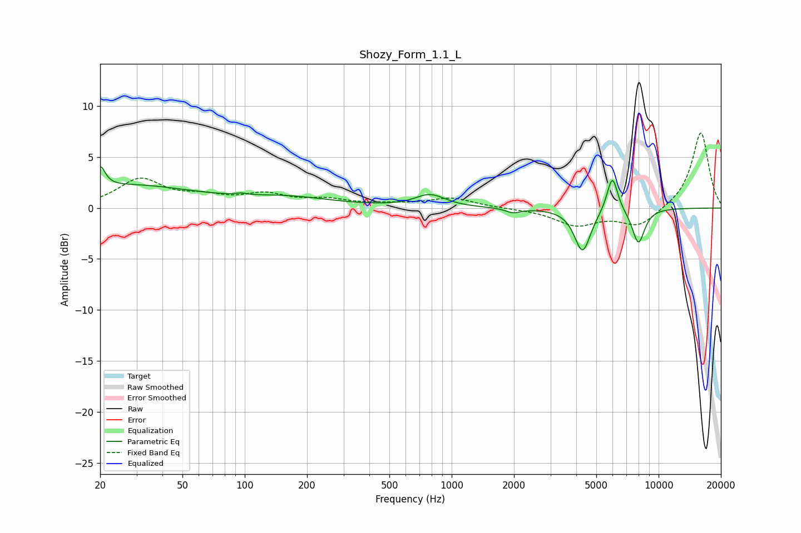

# Shozy_Form_1.1_L
See [usage instructions](https://github.com/jaakkopasanen/AutoEq#usage) for more options and info.

### Parametric EQs
Apply preamp of -4.2 dB when using parametric equalizer.

|   # | Type    |   Fc (Hz) |    Q |   Gain (dB) |
|-----|---------|-----------|------|-------------|
|   1 | Peaking |        20 | 5.98 |         2.1 |
|   2 | Peaking |        27 | 0.45 |         2.1 |
|   3 | Peaking |        97 | 4.72 |         1.4 |
|   4 | Peaking |        98 | 4.56 |        -1.3 |
|   5 | Peaking |       161 | 0.64 |         0.9 |
|   6 | Peaking |       787 | 1.95 |         1.2 |
|   7 | Peaking |      1985 | 3.86 |        -0.5 |
|   8 | Peaking |      4292 | 3.59 |        -4.3 |
|   9 | Peaking |      5976 | 5.29 |         3.6 |
|  10 | Peaking |      7988 | 4.29 |        -3.5 |

### Fixed Band EQs
When using fixed band (also called graphic) equalizer, apply preamp of **-7.4 dB** (if available) and set gains manually with these parameters.

|   # | Type    |   Fc (Hz) |    Q |   Gain (dB) |
|-----|---------|-----------|------|-------------|
|   1 | Peaking |        31 | 1.41 |         2.7 |
|   2 | Peaking |        62 | 1.41 |         0.9 |
|   3 | Peaking |       125 | 1.41 |         1.2 |
|   4 | Peaking |       250 | 1.41 |         0.7 |
|   5 | Peaking |       500 | 1.41 |         0.3 |
|   6 | Peaking |      1000 | 1.41 |         0.9 |
|   7 | Peaking |      2000 | 1.41 |        -0   |
|   8 | Peaking |      4000 | 1.41 |        -1.6 |
|   9 | Peaking |      8000 | 1.41 |        -1.8 |
|  10 | Peaking |     16000 | 1.41 |         7.5 |

### Graphs

