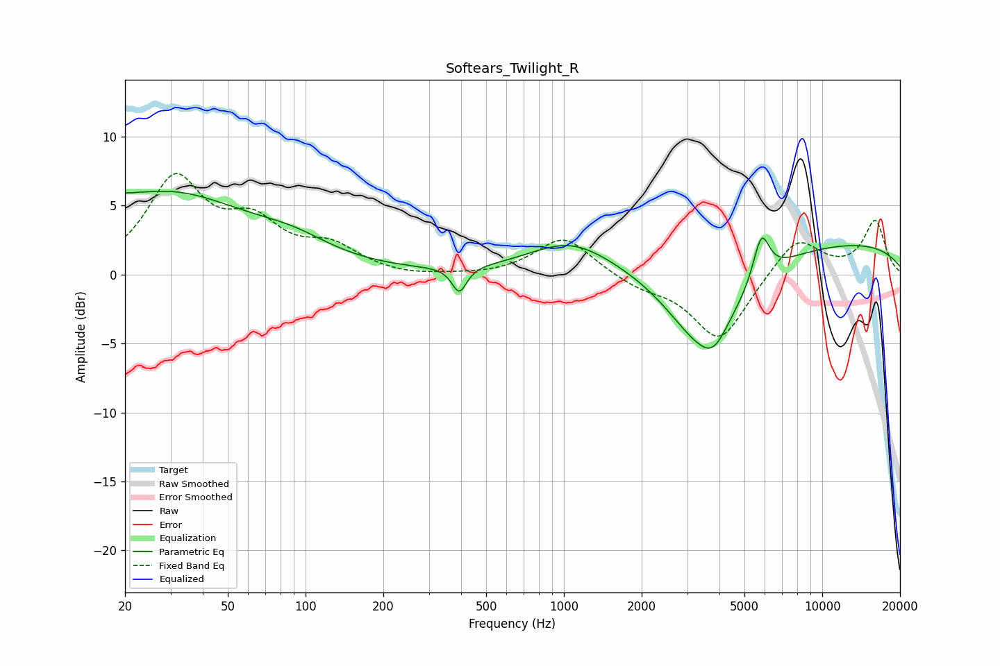

# Softears_Twilight_R
See [usage instructions](https://github.com/jaakkopasanen/AutoEq#usage) for more options and info.

### Parametric EQs
Apply preamp of -6.1 dB when using parametric equalizer.

|   # | Type    |   Fc (Hz) |    Q |   Gain (dB) |
|-----|---------|-----------|------|-------------|
|   1 | Peaking |        21 | 5.53 |         3.4 |
|   2 | Peaking |        21 | 5.9  |        -3   |
|   3 | Peaking |        28 | 0.42 |         5.9 |
|   4 | Peaking |        90 | 0.98 |         1.1 |
|   5 | Peaking |       394 | 5.01 |        -1.9 |
|   6 | Peaking |      1054 | 0.89 |         2.2 |
|   7 | Peaking |      3477 | 0.93 |        -6.8 |
|   8 | Peaking |      3796 | 2.81 |        -1.2 |
|   9 | Peaking |      5814 | 4.35 |         3.3 |
|  10 | Peaking |      8440 | 0.18 |         2.5 |

### Fixed Band EQs
When using fixed band (also called graphic) equalizer, apply preamp of **-7.4 dB** (if available) and set gains manually with these parameters.

|   # | Type    |   Fc (Hz) |    Q |   Gain (dB) |
|-----|---------|-----------|------|-------------|
|   1 | Peaking |        31 | 1.41 |         6.7 |
|   2 | Peaking |        62 | 1.41 |         3.1 |
|   3 | Peaking |       125 | 1.41 |         1.8 |
|   4 | Peaking |       250 | 1.41 |        -0.2 |
|   5 | Peaking |       500 | 1.41 |        -0.1 |
|   6 | Peaking |      1000 | 1.41 |         2.8 |
|   7 | Peaking |      2000 | 1.41 |        -0.8 |
|   8 | Peaking |      4000 | 1.41 |        -4.8 |
|   9 | Peaking |      8000 | 1.41 |         2.8 |
|  10 | Peaking |     16000 | 1.41 |         3.8 |

### Graphs

