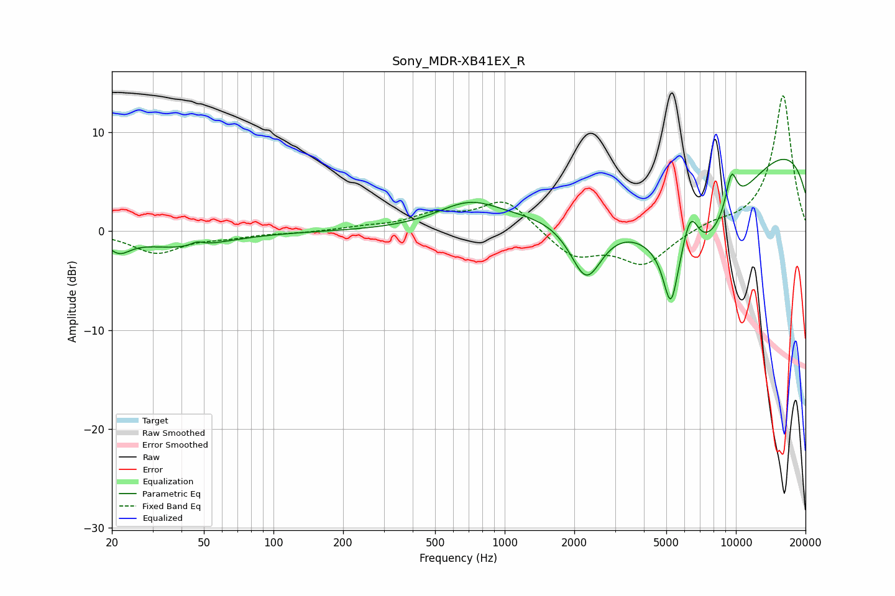

# Sony_MDR-XB41EX_R
See [usage instructions](https://github.com/jaakkopasanen/AutoEq#usage) for more options and info.

### Parametric EQs
Apply preamp of -7.4 dB when using parametric equalizer.

|   # | Type    |   Fc (Hz) |    Q |   Gain (dB) |
|-----|---------|-----------|------|-------------|
|   1 | Peaking |        21 | 2.97 |        -1.5 |
|   2 | Peaking |        40 | 0.76 |        -1.6 |
|   3 | Peaking |        47 | 5.37 |         0.4 |
|   4 | Peaking |       701 | 1.04 |         2.4 |
|   5 | Peaking |      2254 | 1.97 |        -6.3 |
|   6 | Peaking |      5231 | 4.45 |        -5.9 |
|   7 | Peaking |      6351 | 3.41 |         5.2 |
|   8 | Peaking |      6439 | 0.57 |       -13.9 |
|   9 | Peaking |      9559 | 4.95 |         3.8 |
|  10 | Peaking |      9938 | 0.18 |        11.7 |

### Fixed Band EQs
When using fixed band (also called graphic) equalizer, apply preamp of **-13.8 dB** (if available) and set gains manually with these parameters.

|   # | Type    |   Fc (Hz) |    Q |   Gain (dB) |
|-----|---------|-----------|------|-------------|
|   1 | Peaking |        31 | 1.41 |        -2.1 |
|   2 | Peaking |        62 | 1.41 |        -0.5 |
|   3 | Peaking |       125 | 1.41 |        -0.1 |
|   4 | Peaking |       250 | 1.41 |         0.3 |
|   5 | Peaking |       500 | 1.41 |         1.5 |
|   6 | Peaking |      1000 | 1.41 |         3.2 |
|   7 | Peaking |      2000 | 1.41 |        -2.6 |
|   8 | Peaking |      4000 | 1.41 |        -3.3 |
|   9 | Peaking |      8000 | 1.41 |         0.7 |
|  10 | Peaking |     16000 | 1.41 |        13.8 |

### Graphs

