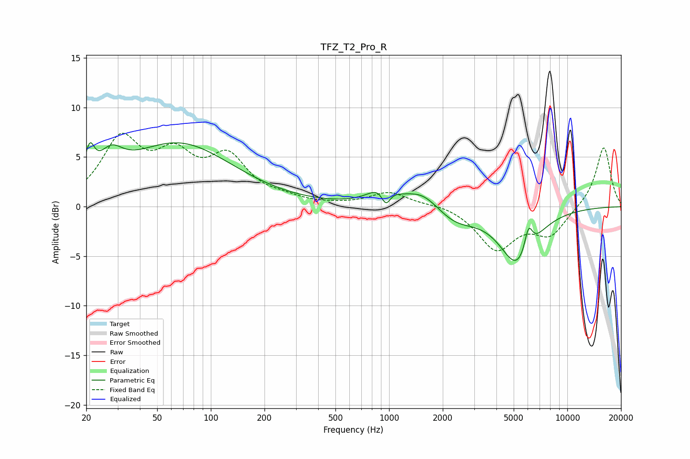

# TFZ_T2_Pro_R
See [usage instructions](https://github.com/jaakkopasanen/AutoEq#usage) for more options and info.

### Parametric EQs
Apply preamp of -6.6 dB when using parametric equalizer.

|   # | Type    |   Fc (Hz) |    Q |   Gain (dB) |
|-----|---------|-----------|------|-------------|
|   1 | Peaking |        21 | 5.44 |         3   |
|   2 | Peaking |        27 | 2.14 |         2.5 |
|   3 | Peaking |        66 | 0.46 |         6.3 |
|   4 | Peaking |       906 | 1.86 |         1.3 |
|   5 | Peaking |       943 | 2.8  |         0.8 |
|   6 | Peaking |       959 | 5.1  |        -2.1 |
|   7 | Peaking |      1542 | 1.4  |         1.8 |
|   8 | Peaking |      2327 | 1.21 |        -1.6 |
|   9 | Peaking |      5255 | 1.42 |        -5.7 |
|  10 | Peaking |      6056 | 6    |         2.6 |

### Fixed Band EQs
When using fixed band (also called graphic) equalizer, apply preamp of **-7.5 dB** (if available) and set gains manually with these parameters.

|   # | Type    |   Fc (Hz) |    Q |   Gain (dB) |
|-----|---------|-----------|------|-------------|
|   1 | Peaking |        31 | 1.41 |         6.4 |
|   2 | Peaking |        62 | 1.41 |         4.3 |
|   3 | Peaking |       125 | 1.41 |         4.5 |
|   4 | Peaking |       250 | 1.41 |         0.6 |
|   5 | Peaking |       500 | 1.41 |         0.1 |
|   6 | Peaking |      1000 | 1.41 |         1.4 |
|   7 | Peaking |      2000 | 1.41 |         0.3 |
|   8 | Peaking |      4000 | 1.41 |        -4.2 |
|   9 | Peaking |      8000 | 1.41 |        -2.7 |
|  10 | Peaking |     16000 | 1.41 |         6.1 |

### Graphs

