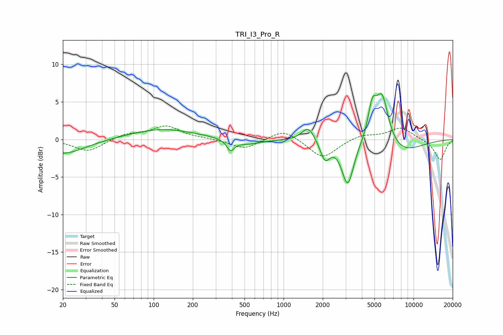

# TRI_I3_Pro_R
See [usage instructions](https://github.com/jaakkopasanen/AutoEq#usage) for more options and info.

### Parametric EQs
Apply preamp of -6.2 dB when using parametric equalizer.

|   # | Type    |   Fc (Hz) |    Q |   Gain (dB) |
|-----|---------|-----------|------|-------------|
|   1 | Peaking |        20 | 0.83 |        -2   |
|   2 | Peaking |       116 | 0.56 |         1.4 |
|   3 | Peaking |       390 | 4.92 |        -1.4 |
|   4 | Peaking |       518 | 1.29 |        -0.7 |
|   5 | Peaking |      1550 | 2.86 |         2   |
|   6 | Peaking |      2082 | 3.9  |        -2.5 |
|   7 | Peaking |      3116 | 3.09 |        -5.9 |
|   8 | Peaking |      4805 | 4.31 |         4   |
|   9 | Peaking |      5722 | 2.7  |         6.7 |
|  10 | Peaking |      7769 | 0.82 |        -1.9 |

### Fixed Band EQs
When using fixed band (also called graphic) equalizer, apply preamp of **-1.9 dB** (if available) and set gains manually with these parameters.

|   # | Type    |   Fc (Hz) |    Q |   Gain (dB) |
|-----|---------|-----------|------|-------------|
|   1 | Peaking |        31 | 1.41 |        -1.6 |
|   2 | Peaking |        62 | 1.41 |         0.7 |
|   3 | Peaking |       125 | 1.41 |         1.7 |
|   4 | Peaking |       250 | 1.41 |         0.1 |
|   5 | Peaking |       500 | 1.41 |        -1.3 |
|   6 | Peaking |      1000 | 1.41 |         1.5 |
|   7 | Peaking |      2000 | 1.41 |        -2.6 |
|   8 | Peaking |      4000 | 1.41 |         0.7 |
|   9 | Peaking |      8000 | 1.41 |         1.6 |
|  10 | Peaking |     16000 | 1.41 |        -2.8 |

### Graphs

