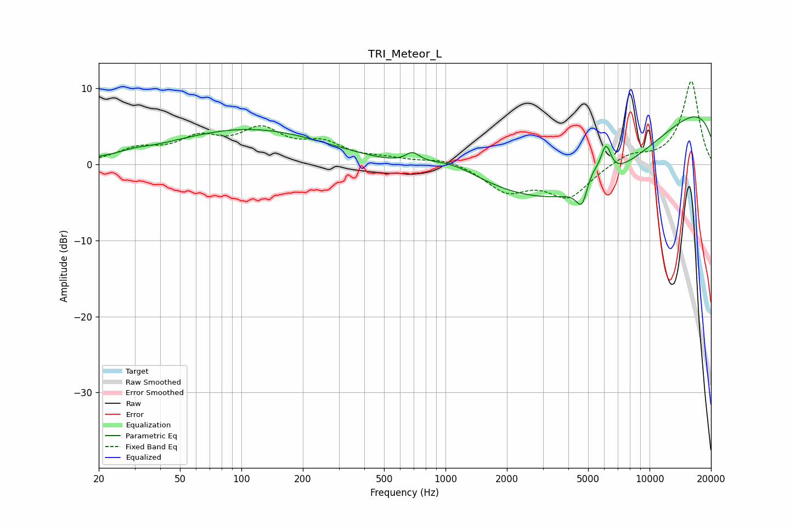

# TRI_Meteor_L
See [usage instructions](https://github.com/jaakkopasanen/AutoEq#usage) for more options and info.

### Parametric EQs
Apply preamp of -6.3 dB when using parametric equalizer.

|   # | Type    |   Fc (Hz) |    Q |   Gain (dB) |
|-----|---------|-----------|------|-------------|
|   1 | Peaking |        30 | 2.3  |         0.4 |
|   2 | Peaking |       110 | 0.37 |         4.6 |
|   3 | Peaking |       690 | 4.16 |         1.3 |
|   4 | Peaking |      1073 | 0.93 |         2.6 |
|   5 | Peaking |      4544 | 0.29 |       -13.5 |
|   6 | Peaking |      4670 | 5.01 |        -3.2 |
|   7 | Peaking |      5220 | 3.33 |         2.1 |
|   8 | Peaking |      6021 | 5.81 |         1.9 |
|   9 | Peaking |      6196 | 6    |         2.1 |
|  10 | Peaking |     10000 | 0.18 |        11.5 |

### Fixed Band EQs
When using fixed band (also called graphic) equalizer, apply preamp of **-11.0 dB** (if available) and set gains manually with these parameters.

|   # | Type    |   Fc (Hz) |    Q |   Gain (dB) |
|-----|---------|-----------|------|-------------|
|   1 | Peaking |        31 | 1.41 |         1.8 |
|   2 | Peaking |        62 | 1.41 |         2.9 |
|   3 | Peaking |       125 | 1.41 |         4   |
|   4 | Peaking |       250 | 1.41 |         2.3 |
|   5 | Peaking |       500 | 1.41 |         0.6 |
|   6 | Peaking |      1000 | 1.41 |         0.8 |
|   7 | Peaking |      2000 | 1.41 |        -3.3 |
|   8 | Peaking |      4000 | 1.41 |        -4.2 |
|   9 | Peaking |      8000 | 1.41 |         1.3 |
|  10 | Peaking |     16000 | 1.41 |        11   |

### Graphs

