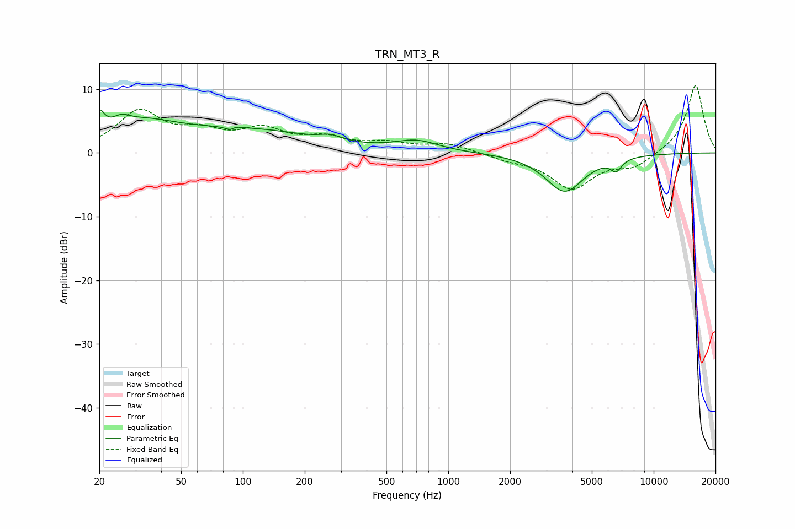

# TRN_MT3_R
See [usage instructions](https://github.com/jaakkopasanen/AutoEq#usage) for more options and info.

### Parametric EQs
Apply preamp of -6.8 dB when using parametric equalizer.

|   # | Type    |   Fc (Hz) |    Q |   Gain (dB) |
|-----|---------|-----------|------|-------------|
|   1 | Peaking |        20 | 5.83 |         3.3 |
|   2 | Peaking |        25 | 3.18 |         1.4 |
|   3 | Peaking |        32 | 0.77 |         3.8 |
|   4 | Peaking |        89 | 5.85 |        -3.2 |
|   5 | Peaking |        90 | 5.94 |         2.9 |
|   6 | Peaking |       109 | 0.43 |         3.3 |
|   7 | Peaking |       268 | 2.83 |         0.8 |
|   8 | Peaking |       702 | 1.35 |         1.7 |
|   9 | Peaking |      3691 | 1.51 |        -6   |
|  10 | Peaking |      6565 | 5.21 |        -1.8 |

### Fixed Band EQs
When using fixed band (also called graphic) equalizer, apply preamp of **-10.7 dB** (if available) and set gains manually with these parameters.

|   # | Type    |   Fc (Hz) |    Q |   Gain (dB) |
|-----|---------|-----------|------|-------------|
|   1 | Peaking |        31 | 1.41 |         6.2 |
|   2 | Peaking |        62 | 1.41 |         2.6 |
|   3 | Peaking |       125 | 1.41 |         3.2 |
|   4 | Peaking |       250 | 1.41 |         2   |
|   5 | Peaking |       500 | 1.41 |         1.3 |
|   6 | Peaking |      1000 | 1.41 |         1.4 |
|   7 | Peaking |      2000 | 1.41 |        -0.8 |
|   8 | Peaking |      4000 | 1.41 |        -5.4 |
|   9 | Peaking |      8000 | 1.41 |        -2.1 |
|  10 | Peaking |     16000 | 1.41 |        10.8 |

### Graphs

