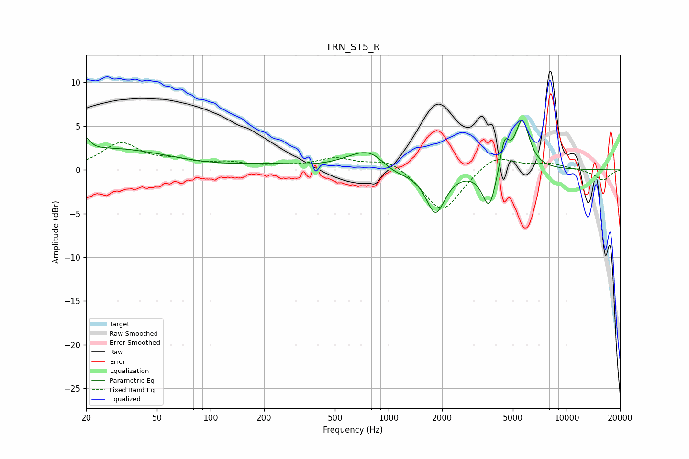

# TRN_ST5_R
See [usage instructions](https://github.com/jaakkopasanen/AutoEq#usage) for more options and info.

### Parametric EQs
Apply preamp of -5.8 dB when using parametric equalizer.

|   # | Type    |   Fc (Hz) |    Q |   Gain (dB) |
|-----|---------|-----------|------|-------------|
|   1 | Peaking |        20 | 5.95 |         1.4 |
|   2 | Peaking |        27 | 0.44 |         2.4 |
|   3 | Peaking |       219 | 0.85 |         0.5 |
|   4 | Peaking |       663 | 1.19 |         0.7 |
|   5 | Peaking |       803 | 1.45 |         2   |
|   6 | Peaking |      1045 | 1.52 |        -1.1 |
|   7 | Peaking |      1836 | 2.66 |        -4.9 |
|   8 | Peaking |      3682 | 3.68 |        -4.6 |
|   9 | Peaking |      4483 | 5.55 |         3.4 |
|  10 | Peaking |      5637 | 3.41 |         5.7 |

### Fixed Band EQs
When using fixed band (also called graphic) equalizer, apply preamp of **-3.2 dB** (if available) and set gains manually with these parameters.

|   # | Type    |   Fc (Hz) |    Q |   Gain (dB) |
|-----|---------|-----------|------|-------------|
|   1 | Peaking |        31 | 1.41 |         2.9 |
|   2 | Peaking |        62 | 1.41 |         0.8 |
|   3 | Peaking |       125 | 1.41 |         0.7 |
|   4 | Peaking |       250 | 1.41 |         0.3 |
|   5 | Peaking |       500 | 1.41 |         1.2 |
|   6 | Peaking |      1000 | 1.41 |         1.3 |
|   7 | Peaking |      2000 | 1.41 |        -5   |
|   8 | Peaking |      4000 | 1.41 |         1.9 |
|   9 | Peaking |      8000 | 1.41 |         0.7 |
|  10 | Peaking |     16000 | 1.41 |        -1.2 |

### Graphs

